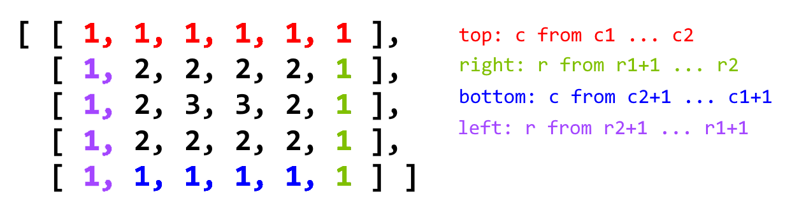

# Array

### 1. Two Sum

1. Brute Force, two level for loop.
2. One Pass Hash

```java
public int[] twoSum(int[] nums, int target) {
    Map<Integer, Integer> map = new HashMap<>();
    for (int i = 0; i < nums.length; i++) {
        int n = target - nums[i];
        if (map.containsKey(n)) {
            return new int[] {i, map.get(n)};
        }
        map.put(nums[i], i);
    }
    return new int[] {};
}
```  

### 53. Maximum Subarray

1. 如果sum小于0， 不管下一个数是正是负，肯定会比这个数加上sum的值大

```java
public int maxSubArray(int[] nums) {
    int sum = Integer.MIN_VALUE;
    int max = Integer.MIN_VALUE;
    for (int i = 0; i < nums.length; i++) {
        if (sum < 0) {
            sum = nums[i];
        } else {
            sum += nums[i];
        }
        max = Math.max(max, sum);
    }
    return max;
}
```  

### 121. Best time to buy and sell stock
1. 两个值，分别记录最大和最小，O(n)遍历一遍，如果price[i] < low更新low, 否则更新max
```java
public int maxProfit(int[] prices) {
    int profit = 0;
    if (prices.length < 2) {
        return profit;
    }
    int low = prices[0];
    for (int i = 0; i < prices.length; i++) {
        if (prices[i] < low) {
            low = prices[i];
        } else {
            profit = Math.max(profit, (prices[i] - low));
        }
    }
    return profit;
}
```  
### 509. Fibonacci Number
1. 使用一个数组，计算出每个下标对应的值，返回array[N].
```java
public int fib(int N) {
    if (N == 0) {
        return 0;
    }
    if (N == 1) {
        return 1;
    }
    int[] f = new int[N + 1];
    f[0] = 0;
    f[1] = 1;
    for (int i = 2; i <= N; i++) {
        f[i] = f[i - 1] + f[i - 2];
    }
    return f[N];
}
```  

### 88. Merge Sorted Array
1. 使用三个指针，m - 1, n - 1, m + n - 1，从右往左更新
```java
public void merge(int[] nums1, int m, int[] nums2, int n) {
    int i = m - 1;
    int j = n - 1;
    int k = m + n - 1;
    while (i >= 0 && j >= 0) {
        if (nums1[i] < nums2[j]) {
            nums1[k] = nums2[j];
            j--;
            k--;
        } else {
            nums1[k] = nums1[i];
            i--;
            k--;
        }
    }
    while (j >= 0) {
        nums1[k] = nums2[j];
        k--;
        j--;
    }
}
```  

### 283. Move Zeroes
1. 双指针，更新右指针，只有在右值不为0的时候交换左右值，同时更新左指针
```java
public void moveZeroes(int[] nums) {
    int l = 0;
    int r = 0;
    while (r < nums.length) {
        if (nums[r] != 0) {
            int tmp = nums[r];
            nums[r] = nums[l];
            nums[l] = tmp;
            l++;
        }
        r++;
    }
}
```  

### 167. Two Sum || - Input array is sorted
1. 双指针，一左一右
```java
public int[] twoSum(int[] numbers, int target) {
    if (numbers.length < 2) {
        return new int[2];
    }
    int left = 0;
    int right = numbers.length - 1;
    while (left < right) {
        int sum = numbers[left] + numbers[right];
        if (sum == target) {
            return new int[] {left + 1, right + 1};
        } else if (sum > target) {
            right--;
        } else {
            left++;
        }
    }
    return new int[2];
}
```  

### 268. Missing Number
1. 求和相减, 为了防止overflow, 减的操作提前执行。
```java
public int missingNumber(int[] nums) {
    int res = 0;
    for (int i = 0; i < nums.length; i++) {
        res += i - nums[i] + 1; // the number after the missing one will have zero
    }
    return res;
}
```  

### 26. Remove Duplicates from Sorted Array
1. Two Pointer, 如果右值不等于左值，左值右移一位，更新左值
```java
public int removeDuplicates(int[] nums) {
    int l = 0;
    for (int r = 1; r < nums.length; r++) {
        if (nums[r] != nums[l]) {
            l++;
            nums[l] = nums[r];
        }
    }
    return l + 1;
}
```  

### 977. Squares of Sorted Array
1. O(nLogn), 遍历数组，求平方，再sort
2. O(n), Two Pointer, 一左一右
```java
public int[] sortedSquares(int[] A) {
    int[] res = new int[A.length];
    if (A.length == 0) {
        return res;
    }

    int l = 0;
    int r = A.length - 1;
    int p = res.length - 1;
    while (l <= r) {
        int i = A[l] * A[l];
        int j = A[r] * A[r];
        if (i > j) {
            res[p] = i;
            p--;
            l++;
        } else {
            res[p] = j;
            p--;
            r--;
        }
    }
    return res;
}
```

## Medium
### 912. Sort an Array
Array排序用quick sort, LinkedList排序用merge sort
1. Merge Sort
```java
class Solution {
    public int[] sortArray(int[] nums) {
        mSort(nums, 0, nums.length - 1);
        return nums;
    }

    public void mSort(int[] nums, int left, int right) {
        if (left >= right) {
            return;
        }

        int mid = (left + right) / 2;
        mSort(nums, left, mid);
        mSort(nums, mid + 1, right);
        merge(nums, left, mid, right);
    }

    public void merge(int[] nums, int left, int mid, int right) {
        int i = left;
        int j = mid + 1;
        int[] tmp = new int[right - left + 1];
        int index = 0;
        while (i <= mid && j <= right) {
            if (nums[i] < nums[j]) {
                tmp[index++] = nums[i++];
            } else {
                tmp[index++] = nums[j++];
            }
        }
        while (i <= mid) {
            tmp[index++] = nums[i++];
        }
        while (j <= right) {
            tmp[index++] = nums[j++];
        }
        for (int k = 0; k < tmp.length; k++) {
            nums[left + k] = tmp[k];
        }
    }
}
```  
2. Quick Sort
```java
class Solution {
    public int[] sortArray(int[] nums) {
        qSort(nums, 0, nums.length - 1);
        return nums;
    }

    public void qSort(int[] nums, int start, int end) {
        if (start >= end) {
            return;
        }

        // 选择pivot点，nums[start], nums[mid], nums[random]
        int pivot = nums[start];
        int left = start;
        int right = end;
        while (left <= right) {
            while (left <= right && nums[left] < pivot) {
                left++;
            }
            while (left <= right && nums[right] > pivot) {
                right--;
            }

            if (left <= right) {
                int tmp = nums[left];
                nums[left] = nums[right];
                nums[right] = tmp;
                left++;
                right--;
            }
        }
        qSort(nums, start, right);
        qSort(nums, left, end);
    }
}
```  

### 15. Three Sum
1. Brute Force, three level for loop O(n^3)
2. Sort数组，第一个数One Pass，二三用双指针
```java
public List<List<Integer>> threeSum(int[] nums) {
    List<List<Integer>> res = new ArrayList<>();
    if (nums.length < 3) {
        return res;
    }
    
    Arrays.sort(nums);
    for (int i = 0; i < nums.length - 2; i++) {
        if (i > 0 && nums[i] == nums[i - 1]) {
            continue;
        }
        
        int l = i + 1;
        int r = nums.length - 1;
        while (l < r) {
            int sum = nums[i] + nums[l] + nums[r];
            if (sum == 0) {
                res.add(Arrays.asList(nums[i], nums[l], nums[r]));
                l++;
                r--;
                while (l < r && nums[l] == nums[l - 1]) {
                    l++;
                }
            } else if (sum > 0) {
                r--;
            } else {
                l++;
            }
        }
    }
    return res;
}
```  

### 56. Merge Intervals
1. Sort Interval的最小值, 使用interval[0]记录区域，判断下一个区域的起点和当前区域的终点，  
重合则更新当前区域终点，否则更新当前区域两端，使用comparator提高效率
```java
public int[][] merge(int[][] intervals) {
    if (intervals == null || intervals.length == 0) {
        return intervals;
    }
    List<int[]> res = new ArrayList<int[]>();
    Arrays.sort(intervals, new IntervalsComparator());
    int[] curInterval = intervals[0];
    res.add(curInterval);
    for (int[] interval : intervals) {
        if (curInterval[1] >= interval[0]) {
            curInterval[1] = Math.max(interval[1], curInterval[1]);
        } else {
            curInterval = interval;
            res.add(curInterval);
        }
    }
    return res.toArray(new int[res.size()][2]);
}

private class IntervalsComparator implements Comparator<int[]> {
    public int compare(int[] a, int[] b) {
        return a[0] - b[0];
    }
}
```

### 33. Search in Rotated Sorted Array
1. Binary Search, 判断中心点在哪个区间, 判断是否在线性的区间内
```java
public int search(int[] nums, int target) {
    int len = nums.length, left = 0, right = len - 1;
    if (left > right)
        return -1;
    while (left <= right) {
        int mid = left + (right - left) / 2;
        if (nums[mid] == target)
            return mid;
        if (nums[left] <= nums[mid]) {
            if (nums[left] <= target && target < nums[mid])
                right = mid - 1;
            else
                left = mid + 1;
        } else {
            if (nums[mid] < target && target <= nums[right])
                left = mid + 1;
            else
                right = mid - 1;
        }
    }
    return -1;
}
```  

### 283. Product of Array Except Self
1. O(n) time, O(1) space, left -> right计算每个点左边的数的乘积,  
right -> left计算每个点右边数的乘积。
```java
public int[] productExceptSelf(int[] nums) {
    int[] res = new int[nums.length];
    res[0] = 1;
    for (int i = 1; i < nums.length; i++) {
        res[i] = nums[i - 1] * res[i - 1];
    }
    int r = 1;
    for (int i = nums.length - 1; i >= 0; i--) {
        res[i] = res[i] * r;
        r *= nums[i];
    }
    return res;
}
```  

### 11. Container With Most Water
1. 双指针, 一左一右, 两个指针的值比大小，更新指针
```java
public int maxArea(int[] height) {
    int l = 0;
    int r = height.length - 1;
    int max = 0;
    while (l < r) {
        max = Math.max(max, (r - l)*(Math.min(height[l], height[r])));
        if (height[l] > height[r]) {
            r--;
        } else {
            l++;
        }
    }
    return max;
}
```  

### 289. Game of Life
1. O(1) space and O(mn) time, copy数组，根据copy计算每个点新值，更新原始board
```java
public void gameOfLife(int[][] board) {

    int[] neighbors = {0, 1, -1};
    int rows = board.length;
    int cols = board[0].length;

    for (int row = 0; row < rows; row++) {
        for (int col = 0; col < cols; col++) {
            int liveNeighbors = 0;

            for (int i = 0; i < 3; i++) {
                for (int j = 0; j < 3; j++) {

                    if (!(neighbors[i] == 0 && neighbors[j] == 0)) {
                        int r = (row + neighbors[i]);
                        int c = (col + neighbors[j]);
                        if ((r < rows && r >= 0) && (c < cols && c >= 0) && (Math.abs(board[r][c]) == 1)) {
                            liveNeighbors += 1;
                        }
                    }
                }
            }

            if ((board[row][col] == 1) && (liveNeighbors < 2 || liveNeighbors > 3)) {
                board[row][col] = -1; // Was live, now dead
            }
            if (board[row][col] == 0 && liveNeighbors == 3) {
                board[row][col] = 2; // Was dead, now live
            }
        }
    }

    for (int row = 0; row < rows; row++) {
        for (int col = 0; col < cols; col++) {
            if (board[row][col] > 0) {
                board[row][col] = 1;
            } else {
                board[row][col] = 0;
            }
        }
    }
}
```  

### 31. Next Permutation
1. 找到下一个全排列，首先找到第一个下降点，从下降序列中找到刚好大于下降点的点，交换两个点，将后面的序列reverse
```java
public void nextPermutation(int[] nums) {
    int i = nums.length - 2;
    while (i >= 0 && nums[i + 1] <= nums[i]) { // find the first decreasing index
        i--;
    }

    if (i >= 0) {
        int j = nums.length - 1;
        while (j >= 0 && nums[j] <= nums[i]) { // find the index just greater than nums[i]
            j--;
        }
        swap(nums, i, j);
    }
    reverse(nums, i + 1);
}

private void swap(int[] nums, int i, int j) {
    int tmp = nums[i];
    nums[i] = nums[j];
    nums[j] = tmp;
}

private void reverse(int[] nums, int start) {
    int i = start;
    int j = nums.length - 1;
    while (i < j) {
        swap(nums, i, j);
        i++;
        j--;
    }
}
```  

### 54. Spiral Matrix
1. Layer by Layer

```java
public List<Integer> spiralOrder(int[][] matrix) {
    List<Integer> list = new ArrayList<>();
    if (matrix.length == 0) {
        return list;
    }

    int r1 = 0;
    int r2 = matrix.length - 1;
    int c1 = 0;
    int c2 = matrix[0].length - 1;
    while (r1 <= r2 && c1 <= c2) {
        for (int c = c1; c <= c2; c++) {
            list.add(matrix[r1][c]);
        }
        for (int r = r1 + 1; r <= r2; r++) {
            list.add(matrix[r][c2]);
        }
        if (r1 < r2 && c1 < c2) {
            for (int c = c2 - 1; c > c1; c--) {
                list.add(matrix[r2][c]);
            }
            for (int r = r2; r > r1; r--) {
                list.add(matrix[r][c1]);
            }
        }
        r1++;
        r2--;
        c1++;
        c2--;
    }
    return list;
}
```  

## Hard
### 4. Median of Two Sorted Array
1. 找到中位数，由于m+n奇偶性不确定，trick: 找到(m+n+1)/2和(m+n+2)/2取平均值  
[解释](https://blog.csdn.net/hk2291976/article/details/51107778)
```java
public double findMedianSortedArrays(int[] nums1, int[] nums2) {
    int n = nums1.length;
    int m = nums2.length;
    if (n > m) {
        return findMedianSortedArrays(nums2, nums1); // make sure n is smaller
    }

    int l1, l2, r1, r2, c1, c2, lo;
    l1 = l2 = r1 = r2 = c1 = c2 = lo = 0;
    int hi = 2 * n;
    while (lo <= hi) {
        c1 = (lo + hi) / 2;
        c2 = m + n - c1;
        l1 = (c1 == 0) ? Integer.MIN_VALUE : nums1[(c1 - 1) / 2];
        r1 = (c1 == 2 * n) ? Integer.MAX_VALUE : nums1[c1 / 2];
        l2 = (c2 == 0) ? Integer.MIN_VALUE : nums2[(c2 - 1) / 2];
        r2 = (c2 == 2 * m) ? Integer.MAX_VALUE : nums2[c2 / 2];

        if (l1 > r2) {
            hi = c1 - 1;
        } else if (l2 > r1) {
            lo = c1 + 1;
        } else {
            break;
        }
    }
    return (Math.max(l1, l2) + Math.min(r1, r2)) / 2.0;
}
```  

### 42. Trapping Rain Water
1. Two Pointer. 
```java
public int trap(int[] height) {
    if (height.length < 3) {
        return 0;
    }

    int vol = 0;
    int l = 0;
    int r = height.length - 1;
    while (l < r && height[l] <= height[l + 1]) l++;
    while (l < r && height[r] <= height[r - 1]) r--;

    while (l < r) {
        int left = height[l];
        int right = height[r];

        if (left <= right) {
            while (l < r && left >= height[++l]) {
                vol += left - height[l];
            }
        } else {
            while (l < r && right >= height[--r]) {
                vol += right - height[r];
            }
        }
    }
    return vol;
}
```  

### 528. Random Pick With Weight
比如若权重数组为 [1, 3, 2] 的话，那么累加和数组为 [1, 4, 6]，整个的权重和为6，我们 rand() % 6，可以随机出范围 [0, 5] 内的数,  
随机到 0 则为第一个点，随机到 1，2，3 则为第二个点，随机到 4，5则为第三个点,  所以我们随机出一个数字x后，然后再累加和数组中查找第一个大于随机数x的数字，使用二分查找法可以找到第一个大于随机数x的数字的坐标，即为所求
```java
int[] sum;
Random random;

public Solution(int[] w) {
    this.random = new Random();
    for (int i = 1; i < w.length; i++) {
        w[i] += w[i - 1];
    }
    this.sum = w;
}
public int pickIndex() {
    int pick = random.nextInt(sum[sum.length - 1]) + 1;
    int left = 0;
    int right = sum.length - 1;
    while (left < right) {
        int mid = left + (right - left) / 2;
        if (pick == sum[mid]) {
            return mid;
        } else if (pick > sum[mid]) {
            left = mid + 1;
        } else {
            right = mid;
        }
    }
    return left;
}
```  

# HashTable
## Easy
### 771. Jewels and Stones
1. Traversal two String, put Jewels in set, and check if stones has jewels.
```java
public int numJewelsInStones(String J, String S) {
    char[] jewels = J.toCharArray();
    Set<Character> set = new HashSet<>();
    for (char c : jewels) {
        set.add(c);
    }
    int cnt = 0;
    char[] stones = S.toCharArray();
    for (char s : stones) {
        if (set.contains(s)) {
            cnt++;
        }
    }
    return cnt;
}
```

### 811. Subdomain Visit Count
1. HashMap<domain, times>, 遍历cpdomains, populate map, traversal through keySet(), add to list.
```java
public List<String> subdomainVisits(String[] cpdomains) {
    List<String> list = new ArrayList<>();
    if (cpdomains.length == 0) {
        return list;
    }

    Map<String, Integer> map = new HashMap<>();
    for (String s : cpdomains) {
        int times = Integer.parseInt(s.split(" ")[0]);
        String domain = s.split(" ")[1];
        for (int i = 0; i < domain.length(); i++) {
            if (domain.charAt(i) == '.') {
                String d = domain.substring(i + 1);
                map.put(d, map.getOrDefault(d, 0) + times);
            }
        }
        map.put(domain, map.getOrDefault(domain, 0) + times);
    }

    for (String s : map.keySet()) {
        list.add(map.get(s) + " " + s);
    }
    return list;
}
```  

### 349. Intersection of Two Arrays
分别遍历两个数组，用set记录元素，第二次遍历，set存在则加入结果
```java
public int[] intersection(int[] nums1, int[] nums2) {
    Set<Integer> set = new HashSet<>();
    List<Integer> list = new ArrayList<>();
    for (int num : nums1) {
        set.add(num);
    }

    for (int num : nums2) {
        if (set.contains(num)) {
            set.remove(num);
            list.add(num);
        }
    }
    int[] res = new int[list.size()];
    for (int i = 0; i < list.size(); i++) {
        res[i] = list.get(i);
    }
    return res;
}
```  

### 350. Intersection of Two Arrays II
原理同上，使用map代替set，如果map的值不为0，则重复值也继续添加
```java
public int[] intersect(int[] nums1, int[] nums2) {
    List<Integer> list = new ArrayList<>();
    Map<Integer, Integer> map = new HashMap<>();
    for (int num : nums1) {
        map.put(num, map.getOrDefault(num, 0) + 1);
    }

    for (int num : nums2) {
        if (map.containsKey(num) && map.get(num) > 0) {
            map.put(num, map.get(num) - 1);
            list.add(num);
        }
    }
    int[] res = new int[list.size()];
    for (int i = 0; i < list.size(); i++) {
        res[i] = list.get(i);
    }
    return res;
}
```

## Medium
### 3. Longest Substring Without Repeating Characters
1. 双指针， 一前一后，如果后不在set里，添加进去，更新后，更新len，否则，删除前，更新前
```java
public int lengthOfLongestSubstring(String s) {
    int len = 0;
    if (s == null || s.length() == 0) {
        return len;
    }

    char[] arr = s.toCharArray();
    Set<Character> set = new HashSet<>();
    int lo = 0;
    int hi = 0;
    while (hi < arr.length) {
        if (!set.contains(arr[hi])) {
            set.add(arr[hi]);
            hi++;
            len = Math.max((hi - lo), len);
        } else {
            set.remove(arr[lo]);
            lo++;
        }
    }
    return len;

}
```  
2. Optimization 使用map代替set，map存char对应的上一次出现重复的地方，免去i一个一个更新和判断
```java
public int lengthOfLongestSubstring(String s) {
    int n = s.length();
    int len = 0;
    Map<Character, Integer> map = new HashMap<>();
    for (int j = 0, i = 0; j < n; j++) {
        if (map.containsKey(s.charAt(j))) {
            i = Math.max(map.get(s.charAt(j)), i); // 直接跳到j的最新位置
        }
        len = Math.max(len, j - i + 1);
        map.put(s.charAt(j), j + 1);
    }
    return len;
}
```  

### 242. Valid Anagram
将字符串转为字符数组，然后逐一比较
```java
public boolean isAnagram(String s, String t) {
    if (s.length() != t.length()) {
        return false;
    }

    char[] chs = s.toCharArray();
    char[] cht = t.toCharArray();
    Arrays.sort(chs);
    Arrays.sort(cht);
    for (int i = 0; i < chs.length; i++) {
        if (chs[i] != cht[i]) {
            return false;
        }
    }
    return true;
}
```  
None Sorting solution
```java
public boolean isAnagram(String s, String t) {
    if (s.length() != t.length()) return false;
    int[] cnt = new int[26];
    for (char c : s.toCharArray()) {
        cnt[c - 'a']++;
    }
    for (char c : t.toCharArray()) {
        cnt[c - 'a']--;
    }
    for (int i : cnt) {
        if (i != 0) {
            return false;
        }
    }
    return true;
}
```  

### 49. Grouped Anagrams
1. HashMap<String, List>, key是每个string sort过之后的，遍历一遍，判断当前string sort过之后是否存在在map中
```java
public List<List<String>> groupAnagrams(String[] strs) {
    if (strs.length == 0) {
        return new ArrayList();
    }

    Map<String, List> map = new HashMap<>();
    for (String str : strs) {
        char[] chs = str.toCharArray();
        Arrays.sort(chs);
        String key = String.valueOf(chs);
        if (!map.containsKey(key)) {
            map.put(key, new ArrayList<>());
        }
        map.get(key).add(str);
    }
    return new ArrayList(map.values());
}
```  

### 560. Subarray Sum Equals K
1. O(n^2), 一个数组记录叠加到当前index时，前面的数值总和，双指针一前一后，判断差值是否为k，更新cnt
```java
public int subarraySum(int[] nums, int k) {
    int cnt = 0;
    int[] sum = new int[nums.length + 1];
    sum[0] = 0;
    for (int i = 1; i <= nums.length; i++) {
        sum[i] = nums[i - 1] + sum[i - 1];
    }
    for (int lo = 0; lo < nums.length; lo++) {
        for (int hi = lo + 1; hi <= nums.length; hi++) {
            if (sum[hi] - sum[lo] == k) {
                cnt++;
            }
        }
    }
    return cnt;
}
```
2. O(n), HashMap, <curricularSum, numOfOccurance>, 如果在两个sum的区间内，则sum[j] - k = sum[i], i一定存在map的entry.
```java
public int subarraySum(int[] nums, int k) {
    Map<Integer, Integer> map = new HashMap<>();
    map.put(0, 1);
    int cnt = 0;
    int sum = 0;
    for (int i = 0; i < nums.length; i++) {
        sum += nums[i];
        if (map.containsKey(sum - k)) {
            cnt += map.get(sum - k);
        }
        map.put(sum, map.getOrDefault(sum, 0) + 1);
    }
    return cnt;
}
```  

### 380. Insert Delete GetRandom O(1)
1. HashMap记录val和在ArrayList对应的下标，remove的时候如不是删最后一位则换位置
```java
class RandomizedSet {
    ArrayList<Integer> nums;
    HashMap<Integer, Integer> locs;
    java.util.Random rand = new java.util.Random();

    /** Initialize your data structure here. */
    public RandomizedSet() {
        nums = new ArrayList<Integer>();
        locs = new HashMap<Integer, Integer>();
    }

    /** Inserts a value to the set. Returns true if the set did not already contain the specified element. */
    public boolean insert(int val) {
        boolean contain = locs.containsKey(val);
        if (contain) return false;
        locs.put( val, nums.size());
        nums.add(val);
        return true;
    }

    /** Removes a value from the set. Returns true if the set contained the specified element. */
    public boolean remove(int val) {
        boolean contain = locs.containsKey(val);
        if (!contain) return false;
        int loc = locs.get(val);
        if (loc < nums.size() - 1) { // not the last one, swap
            int lastone = nums.get(nums.size() - 1);
            nums.set(loc, lastone);
            locs.put(lastone, loc);
        }
        locs.remove(val);
        nums.remove(nums.size() - 1);
        return true;
    }

    /** Get a random element from the set. */
    public int getRandom() {
        return nums.get( rand.nextInt(nums.size()) );
    }
}
```  

### 609. Find Duplicate File in System
1. HashMap，括号内的作为key，value是List<String>
```java
public List<List<String>> findDuplicate(String[] paths) {
    Map<String, List<String>> map = new HashMap<>();
    for (String path : paths) {
        String[] parts = path.split(" ");
        for (int i = 1; i < parts.length; i++) {
            int k = parts[i].indexOf("(");
            String content = parts[i].substring(k, parts[i].length() - 1);
            map.putIfAbsent(content, new LinkedList<>());
            map.get(content).add(parts[0] + "/" + parts[i].substring(0, k));
        }
    }
    List<List<String>> r = new LinkedList<>();
    for (List<String> list : map.values())
        if (list.size() > 1)
            r.add(list);
    return r;
}
```  

## Hard
### 76. Minimum Window Substring
1.预扫描目标字符串 t，哈希表存储出现的字符及其个数
2.遍历 源字符串s，遇到 t 中字符，其哈希值减一，直到当前子串包含了所有 t 中的字符，记录该子串，并更新最小子串。
3.收缩该子串，首指针右移
    3.1忽略不在 t 中的字符。
    3.2当子串中出现某字符次数多于 t 中该字符的个数，也可忽略该字符。比如 找到某子串 AACD ，t = ACD，则第一个A也可忽略。
    3.3直到右移至 该子串缺失某字符。如 ACD -> CD, count--, 跳出循环
4.重复2，直到遍历到s尾
```java
public String minWindow(String s, String t) {
    if (t.length() > s.length()) {
        return "";
    }
    
    Map<Character, Integer> map = new HashMap<>();
    for (char c : t.toCharArray()) {
        map.put(c, map.getOrDefault(c, 0) + 1);
    }
    
    int count = 0; // 记录匹配到的字符个数，count == t.length()表示全部找到
    int minStart = 0;
    int minLen = s.length() + 1;
    int start = 0;
    for (int end = 0; end < s.length(); end++) { // 缩减字符串长度
        char key = s.charAt(end);
        if (map.containsKey(key)) {
            map.put(key, map.get(key) - 1);
            if (map.get(key) >= 0) {
                count++;
            }
            while(count == t.length()) {
                if (end - start + 1 < minLen) {
                    minStart = start;
                    minLen = end - start + 1;
                }
                char keyy = s.charAt(start);
                if (map.containsKey(keyy)) { // 首指针在目标字符串中，还原该值
                    map.put(keyy, map.get(keyy) + 1);
                    if (map.get(keyy) > 0) {
                        count--;
                    }
                }
                start++;
            }
        }
    }
    if (minLen > s.length()) {
        return "";
    }
    return s.substring(minStart, minStart + minLen);
}
```

### 336. Palindrome Pairs
1. Brute Force, 两两配对，正反concatenation, 判断是否是回文O(n^2)
2. 见注释
```java
public List<List<Integer>> palindromePairs(String[] words) {
    if (words == null || words.length < 2) {
        return new ArrayList<>();
    }

    List<List<Integer>> lists = new ArrayList<>();
    Map<String, Integer> map = new HashMap<>();
    // 将单词和下标放入map
    for (int i = 0; i < words.length; i++) {
        map.put(words[i], i);
    }

    // 将单词进行切割
    for (int i = 0; i < words.length; i++) {
        // j <= words[i].length主要是为了防止["a",""]空单词的出现
        for (int j = 0; j <= words[i].length(); j++) {
            String left = words[i].substring(0, j);
            String right = words[i].substring(j);
            // 分别判断左右两边是否是回文
            if (isPalindrome(left)) {
                // 判断是否存在另一部分的逆序字符串
                String rightReverse = new StringBuilder(right).reverse().toString();
                if(map.containsKey(rightReverse) && map.get(rightReverse) != i) {
                    lists.add(Arrays.asList(map.get(rightReverse), i));
                }
            }

            if (isPalindrome(right)) {
                String leftReverse = new StringBuilder(left).reverse().toString();
                // 防止重复判断，left已经处理了空值的情况
                if(map.containsKey(leftReverse) && map.get(leftReverse) != i && right.length() != 0) {
                    lists.add(Arrays.asList(i, map.get(leftReverse)));
                }
            }
        }
    }
    return lists;
}

private boolean isPalindrome(String str) {
    int left = 0;
    int right = str.length() - 1;
    while (left < right) {
        if (str.charAt(left) != str.charAt(right)) {
            return false;
        }
        left++;
        right--;
    }
    return true;
}
```  

### 981. Time Based key-value Store
使用一个map来存储 key - (timestamp - value)
```java
class TimeMap {

    Map<String, Map> map; // key - (timestamp - value)
    /** Initialize your data structure here. */
    public TimeMap() {
        map = new HashMap<>();
    }

    public void set(String key, String value, int timestamp) {
        Map<Integer, String> tmp = map.getOrDefault(key, new HashMap<>());
        tmp.put(timestamp, value);
        map.put(key, tmp);
    }

    public String get(String key, int timestamp) {
        if (!map.containsKey(key)) {
            return "";
        } else {
            Map<Integer, String> tmp = map.get(key);
            for (int i = timestamp; i >= 0; i--) { // 寻找pre_timestmap <= timestamp
                if (tmp.containsKey(i)) {
                    return tmp.get(i);
                }
            }
            return "";
        }
    }
}
```  

# LinkedList
## Easy
### 206. Reversed LinkedList
```java
public ListNode reverseList(ListNode head) {
    ListNode pre = null;
    ListNode curr = head;
    while (curr != null) {
        ListNode node = curr.next;
        curr.next = pre;
        pre = curr;
        curr = node;
    }
    return pre;
}
```

### 21. Merge Two Sorted Lists
1. Recursion
```java
public ListNode mergeTwoLists(ListNode l1, ListNode l2) {
    if (l1 == null) return l2;
    if (l2 == null) return l1;

    if (l1.val < l2.val) {
        l1.next = mergeTwoLists(l1.next, l2);
        return l1;
    } else {
        l2.next = mergeTwoLists(l2.next, l1);
        return l2;
    }
}
```  
2. Iterator
```java
public ListNode mergeTwoLists(ListNode l1, ListNode l2) {
    ListNode preHead = new ListNode(-1);
    ListNode pre = preHead;
    
    while (l1 != null && l2 != null) {
        if (l1.val < l2.val) {
            pre.next = l1;
            l1 = l1.next;
        } else {
            pre.next = l2;
            l2 = l2.next;
        }
        pre = pre.next;
    }
    if (l1 == null) {
        pre.next = l2;
    }
    if (l2 == null) {
        pre.next = l1;
    }
    return preHead.next;
}
```  

### 2. Add Two Numbers
1. 定义carry记录进位
```java
public ListNode addTwoNumbers(ListNode l1, ListNode l2) {
    ListNode head = new ListNode(0);
    ListNode p = l1;
    ListNode q = l2;
    ListNode curr = head;
    int carry = 0;
    while (p != null || q != null) {
        int x = p == null ? 0 : p.val;
        int y = q == null ? 0 : q.val;
        int sum = x + y + carry;
        carry = sum / 10;
        curr.next = new ListNode(sum % 10);
        curr = curr.next;
        if (p != null) p = p.next;
        if (q != null) q = q.next;
    }
    if (carry > 0) {
        curr.next = new ListNode(carry);
    }
    return head.next;
}
``` 

### 445. Add Two Numbers II

思路同上，使用两个stack来存储list的值, 后面相加的时候再pop就好了

```java
public ListNode addTwoNumbers(ListNode l1, ListNode l2) {
    Stack<Integer> s1 = new Stack<>();
    Stack<Integer> s2 = new Stack<>();
    while (l1 != null) {
        s1.push(l1.val);
        l1 = l1.next;
    }
    while (l2 != null) {
        s2.push(l2.val);
        l2 = l2.next;
    }
    int carry = 0;
    ListNode node = null;
    while (!s1.empty() || !s2.empty()) {
        int x = s1.empty() ? 0 : s1.pop();
        int y = s2.empty() ? 0 : s2.pop();
        int sum = x + y + carry;
        carry = sum / 10;
        ListNode n = new ListNode(sum % 10);
        n.next = node;
        node = n;
    }
    if (carry > 0) {
        ListNode head = new ListNode(carry);
        head.next = node;
        node = head;
    }
    return node;
}
```  

## Hard
### 23. Merge K Sorted List
1. Divide and Conquer, 比如合并6个链表，那么按照分治法，我们首先分别合并0和3，1和4，2和5.  这样下一次只需合并3个链表，我们再合并1和3，最后和2合并就可以了
```java
public ListNode mergeKLists(ListNode[] lists) {
    if (lists == null || lists.length == 0) {
        return null;
    }
    int n = lists.length;
    while (n > 1) {
        int k = (n + 1) / 2;
        for (int i = 0; i < n / 2; i++) {
            lists[i] = mergeTwoLists(lists[i], lists[i + k]);
        }
        n = k;
    }
    return lists[0];
}

private ListNode mergeTwoLists(ListNode n1, ListNode n2) {
    ListNode head = new ListNode(-1);
    ListNode curr = head;
    while (n1 != null && n2 != null) {
        if (n1.val > n2.val) {
            curr.next = n2;
            n2 = n2.next;
        } else {
            curr.next = n1;
            n1 = n1.next;
        }
        curr = curr.next;
    }
    // 如果n1或者n2还有剩余的点
    if (n1 != null) {
        curr.next = n1;
    }
    if (n2 != null) {
        curr.next = n2;
    }
    return head.next;
}
```  

### 234. Palindrome Linked List
1. O(n) space, convert linked list to array, then solve it 
2. O(1) space, convert second half of the list
```java
public boolean isPalindrome(ListNode head) {
    ListNode fast = head;
    ListNode slow = head;
    while (fast != null && fast.next != null) {
        slow = slow.next;
        fast = fast.next.next;
    }
    // odd nodes
    if (fast != null) {
        slow = slow.next;
    }

    slow = reverse(slow);
    fast = head;
    while (slow != null) {
        if (slow.val != fast.val) {
            return false;
        }
        slow = slow.next;
        fast = fast.next;
    }
    return true;
}

public ListNode reverse(ListNode head) {
    ListNode prev = null;
    while (head != null) {
        ListNode next = head.next;
        head.next = prev;
        prev = head;
        head = next;
    }
    return prev;
}
```  
# Math and String
### 20. Valid Parentheses
使用stack, 遍历的时候将对称的parentheses放入stack，不存在的时候pop，最后检查stack是否为空
```java
public boolean isValid(String s) {
    Stack<Character> stack = new Stack<>();
    char[] chs = s.toCharArray();
    for (char c : chs) {
        if (c == '{') {
            stack.push('}');
        } else if (c == '(') {
            stack.push(')');
        } else if (c == '[') {
            stack.push(']');
        } else {
            if (stack.empty() || stack.pop() != c) {
                return false;
            }
        }
    }
    return stack.empty();
}
```  

### 937. Reorder Log Files
用两个ArrayList分别存num log和letter log, sort letter log, 最后拼在一起
```java
class LetterComparator implements Comparator<String> {
    @Override
    public int compare(String s1, String s2) {
        String ss1 = s1.substring(s1.indexOf(" ") + 1);
        String ss2 = s2.substring(s2.indexOf(" ") + 1);
        if (ss1.compareTo(ss2) > 0) {
            return 1;
        } else {
            return -1;
        }
    }
}

class Solution {
    public String[] reorderLogFiles(String[] logs) {
        List<String> numList = new ArrayList<>();
        List<String> letterList = new ArrayList<>();

        for (String log : logs) {
            if (Character.isDigit(log.charAt(log.length() - 1))) {
                numList.add(log);
            } else {
                letterList.add(log);
            }
        }

        Collections.sort(letterList, new LetterComparator());
        String[] res = new String[logs.length];
        letterList.addAll(numList);
        res = letterList.toArray(res);
        return res;
    }
}
```  

### 7. Reverse Integer
Use Long for result incase of overflow
```java
public int reverse(int x) {
    long res = 0;
    while (x != 0) {
        res = res * 10 + x % 10;
        x /= 10;
    }
    if (res > Integer.MAX_VALUE || res < Integer.MIN_VALUE) {
        return 0;
    }
    return (int)res;
}
```

### 344. Reverse String
Two Pointer, left, right
```java
public void reverseString(char[] s) {
    int l = 0;
    int r = s.length - 1;
    while (l < r) {
        char tmp = s[l];
        s[l] = s[r];
        s[r] = tmp;
        l++;
        r--;
    }
}
``` 

### 13. Roman to Integer
```java
public int romanToInt(String s) {
    char[] chs = s.toCharArray();
    Map<Character, Integer> map = new HashMap<>();
    map.put('I', 1);
    map.put('V', 5);
    map.put('X', 10);
    map.put('L', 50);
    map.put('C', 100);
    map.put('D', 500);
    map.put('M', 1000);
    int sum = 0;
    for (int i = 0; i < chs.length; i++) {
        if (i == (chs.length - 1)) {
            sum += map.get(chs[i]);
            continue;
        }
        if (map.get(chs[i]) < map.get(chs[i+1])) {
            sum -= map.get(chs[i]);
        } else {
            sum += map.get(chs[i]);
        }
    }
    return sum;
}
```  

### 202. Happy Number
1. Floyed Cycle Detection, O(1) space
```java
private int calSum(int n) {
    int sum = 0, tmp;
    while (n != 0) {
        tmp = n % 10;
        sum += tmp * tmp;
        n /= 10;
    }
    return sum;
}

public boolean isHappy(int n) {
    int slow, fast;
    slow = fast = n;
    while (slow > 1) {
        slow = calSum(slow);
        if (slow == 1) {
            return true;
        }
        fast = calSum(fast);
        fast = calSum(fast);
        if (fast == 1) {
            return true;
        }
        if (slow == fast) { // loop detected
            return false;
        }
    }
    return true;
}
```  
2. HashSet, 如果新的计算结果不能加到set中，则返回false，只有在计算结果为1时返回true
```java
public boolean isHappy(int n) {
    Set<Integer> set = new HashSet<>();
    int tmp, sum;
    while (set.add(n)) {
        sum = 0;
        while (n > 0) {
            tmp = n % 10;
            sum += tmp * tmp;
            n /= 10;
        }
        if (sum == 1) {
            return true;
        } else {
            n = sum;
        }
    }
    return false;
}
```  

### 415. Add Strings
用StringBuilder，从末位开始向前叠加，使用carry记录进位
```java
public String addStrings(String num1, String num2) {
    int i = num1.length() - 1;
    int j = num2.length() - 1;
    int carry = 0;
    char[] num1Array = num1.toCharArray();
    char[] num2Array = num2.toCharArray();
    StringBuilder sb = new StringBuilder();
    while (i >= 0 || j >= 0 || carry == 1) {
        int a = i >= 0 ? (num1Array[i--] - '0') : 0;
        int b = j >= 0 ? (num2Array[j--] - '0') : 0;
        int sum = a + b + carry;
        sb.insert(0, sum % 10);
        carry = sum / 10;
    }
    return sb.toString();
}
```  

### 5. Longest Palindrome Substring
1. Brute Force O(n^3)
2. 从中心向两端扩展，奇偶分开考虑, (s, i, i), (s, i, i + 1), 找到新的len更新longest，计算出start位置
```java
public String longestPalindrome(String s) {
    if (s == null || s.length() == 0) {
        return "";
    }

    int start = 0;
    int len = 0;
    int longest = 0;
    for (int i = 0; i < s.length(); i++) {
        len = findLongest(s, i, i);
        if (len > longest) {
            longest = len;
            start = i - len / 2;
        }
        len = findLongest(s, i, i + 1);
        if (len > longest) {
            longest = len;
            start = i - len / 2 + 1;
        }
    }
    return s.substring(start, start + longest);
}

private int findLongest(String s, int start, int end) {
    int len = 0;
    while (start >= 0 && end < s.length()) {
        if (s.charAt(start) != s.charAt(end)) {
            break;
        }
        len += start == end ? 1 : 2;
        start--;
        end++;
    }
    return len;
}
```  

### 22. Generate Parentheses
First, the first character should be “(“. Second, at each step, you can either print “(“ or “)”,  
but print “)” only when there are more “(“s than “)”s. Stop printing out “(“ when the number of “(“ s hit n.  
The first actually merges into the second condition.
```java
public List<String> generateParenthesis(int n) {
    List<String> list = new ArrayList<>();
    backtracking(list, "", 0, 0, n);
    return list;
}

public void backtracking(List<String> list, String str,
                         int left, int right, int n) {
    if (str.length() == 2*n) {
        list.add(str);
        return;
    }

    if (left < n) {
        backtracking(list, str + "(", left + 1, right, n);
    }
    if (right < left) {
        backtracking(list, str + ")", left, right + 1, n);
    }
}
```  

### 17. Letter Combination of a Phone Number
1. Single queue BFS
public List<String> letterCombinations(String digits) {
    LinkedList<String> list = new LinkedList<>();
    if (digits.isEmpty()) {
        return list;
    }

    String[] buttons = {"0", "1", "abc", "def", "ghi", "jkl", "mno", "pqrs", "tuv", "wxyz"};
    list.add("");
    char[] dc = digits.toCharArray();

    for (int i = 0; i < dc.length; i++) {
        char[] letters = buttons[dc[i] - '0'].toCharArray();
        while (list.peek().length() == i) { // Make sure it's on the same level
            String row = list.poll();
            for (char letter : letters) {
                list.add(row + letter);
            }
        }
     }
    return list;
}
```  

### 273. Integer to English Word
Intuitive
```java
public String numberToWords(int num) {
    if (num == 0) {
        return "Zero";
    }
    
    return helper(num);
}

public String helper(int num) {
    String[] words = {"", "One", "Two", "Three", "Four", "Five", "Six", "Seven", "Eight", "Nine", "Ten",
    "Eleven", "Twelve", "Thirteen", "Fourteen", "Fifteen", "Sixteen", "Seventeen", "Eighteen", "Nineteen",
    "Twenty", "Thirty", "Forty", "Fifty", "Sixty", "Seventy", "Eighty", "Ninety"};
    StringBuilder res = new StringBuilder();
    
    if (num >= 1000000000) {
        res.append(helper(num / 1000000000)).append(" Billion ").append(helper(num % 1000000000));
    } else if (num >= 1000000) {
        res.append(helper(num / 1000000)).append(" Million ").append(helper(num % 1000000));
    } else if (num >= 1000) {
        res.append(helper(num / 1000)).append(" Thousand ").append(helper(num % 1000));
    } else if (num >= 100) {
        res.append(helper(num / 100)).append(" Hundred ").append(helper(num % 100));
    } else if (num >= 20) {
        res.append(words[(num - 20) / 10 + 20]).append(" ").append(helper(num % 10));
    } else {
        res.append(words[num]);
    }
    return res.toString().trim();
}
```   

### 227. Basic Calculator II
使用stack, 将每次计算出的数存在stack中
```java
public int calculate(String s) {
    int len = s.length();
    if (s == null || len == 0) {
        return 0;
    }

    Stack<Integer> stack = new Stack<>();
    int num = 0; // 记录每一个数字
    char sign = '+'; // 默认符号为+
    for (int i = 0; i < len; i++) {
        if (Character.isDigit(s.charAt(i))) {
            num = num * 10 + (s.charAt(i) - '0');
        }
        if (!Character.isDigit(s.charAt(i)) && (s.charAt(i) != ' ') || (i == len - 1)) {
            switch(sign) {
                case '-':
                    stack.push(-num);
                    break;
                case '+':
                    stack.push(num);
                    break;
                case '*':
                    stack.push(stack.pop() * num);
                    break;
                case '/':
                    stack.push(stack.pop() / num);
                    break;
            }
            sign = s.charAt(i);
            num = 0;
        }
    }
    int res = 0;
    for (int i : stack) {
        res += i;
    }
    return res;
}
```  

### 224. Basic Calculator
使用stack存放sign和中间结果
```java
public int calculate(String s) {
    int len = s.length();
    if (s == null || len == 0) {
        return 0;
    }
    Stack<Integer> stack = new Stack<>();
    int res = 0;
    int sign = 1;
    for (int i = 0; i < len; i++) {
        if (Character.isDigit(s.charAt(i))) { // 找到数字
            int sum = s.charAt(i) - '0';
            while (i + 1 < len && Character.isDigit(s.charAt(i + 1))) {
                sum = sum * 10 + s.charAt(i + 1) - '0';
                i++;
            }
            res += sum * sign; // 计算出中间结果
        } else if (s.charAt(i) == '+') {
            sign = 1;
        }
        else if (s.charAt(i) == '-') {
            sign = -1;
        }
        else if (s.charAt(i) == '(') { // 中间结果、符号放入栈，重置两个变量
            stack.push(res);
            stack.push(sign);
            res = 0;
            sign = 1;
        } else if (s.charAt(i) == ')') {
            res = res * stack.pop() + stack.pop();
        }
    }
    return res;
}
```  

### 8. String to Integer (atoi)
```java
public int myAtoi(String str) {
    int index = 0, sign = 1, total = 0;
    //1. Empty string
    if(str.length() == 0) {
        return 0;
    }

    //2. Remove Spaces
    while(index < str.length() && str.charAt(index) == ' ') {
        index ++;
    }

    // handle " "
    if (index == str.length()) {
        return 0;
    }
    //3. Handle signs
    if(str.charAt(index) == '+' || str.charAt(index) == '-'){
        sign = str.charAt(index) == '+' ? 1 : -1;
        index ++;
    }

    //4. Convert number and avoid overflow
    while (index < str.length()) {
        int digit = str.charAt(index) - '0';
        if (digit < 0 || digit > 9) {
            break;
        }

        //check if total will be overflow after 10 times and add digit
        if (Integer.MAX_VALUE/10 < total || Integer.MAX_VALUE/10 == total
            && Integer.MAX_VALUE %10 < digit) {
            return sign == 1 ? Integer.MAX_VALUE : Integer.MIN_VALUE;
        }
        total = 10 * total + digit;
        index ++;
    }
    return total * sign;
}
```  

## Hard  
### 10. Regular Expression Matching
1. Funny solution
```java
public boolean isMatch(String s, String p) {
    return s.matches(p);
}
```  
2. 1, If p.charAt(j) == s.charAt(i) :  dp[i][j] = dp[i-1][j-1];
2, If p.charAt(j) == '.' : dp[i][j] = dp[i-1][j-1];
3, If p.charAt(j) == '*': 
here are two sub conditions:
       1   if p.charAt(j-1) != s.charAt(i) : dp[i][j] = dp[i][j-2]  //in this case, a* only counts as empty
       2   if p.charAt(i-1) == s.charAt(i) or p.charAt(i-1) == '.':
        dp[i][j] = dp[i-1][j]    //in this case, a* counts as multiple a 
        or dp[i][j] = dp[i][j-1]   // in this case, a* counts as single a
        or dp[i][j] = dp[i][j-2]   // in this case, a* counts as empty
```java
public boolean isMatch(String s, String p) {
    if(s == null || p == null) {
        return false;
    }
    boolean[][] state = new boolean[s.length() + 1][p.length() + 1];
    state[0][0] = true;
    // no need to initialize state[i][0] as false
    // initialize state[0][j]
    for (int j = 1; j < state[0].length; j++) {
        if (p.charAt(j - 1) == '*') {
            if (state[0][j - 1] || (j > 1 && state[0][j - 2])) {
                state[0][j] = true;
            }
        }
    }
    for (int i = 1; i < state.length; i++) {
        for (int j = 1; j < state[0].length; j++) {
            if (s.charAt(i - 1) == p.charAt(j - 1) || p.charAt(j - 1) == '.') {
                state[i][j] = state[i - 1][j - 1];
            }
            if (p.charAt(j - 1) == '*') {
                if (s.charAt(i - 1) != p.charAt(j - 2) && p.charAt(j - 2) != '.') {
                    state[i][j] = state[i][j - 2];
                } else {
                    state[i][j] = state[i - 1][j] || state[i][j - 1] || state[i][j - 2];
                }
            }
        }
    }
    return state[s.length()][p.length()];
}
```   

### 68. Text Justification
```java
//首先要做的就是确定每一行能放下的单词数，这个不难，就是比较n个单词的长度和加上n - 1个空格的长度跟给定的长度L来比较即可
//找到了一行能放下的单词个数，然后计算出这一行存在的空格的个数，是用给定的长度L减去这一行所有单词的长度和。
//得到了空格的个数之后，就要在每个单词后面插入这些空格，这里有两种情况，比如某一行有两个单词"to" 和 "a"，给定长度L为6
//如果这行不是最后一行，那么应该输出"to   a"，如果是最后一行，则应该输出 "to a  "，所以这里需要分情况讨论，最后一行的处理方法和其他行之间略有不同。
//最后一个难点就是，如果一行有三个单词，这时候中间有两个空，如果空格数不是2的倍数，那么左边的空间里要比右边的空间里多加入一个空格，那么我们只需要用总的空格数除以空间个数
//能除尽最好，说明能平均分配，除不尽的话就多加个空格放在左边的空间里"
public List<String> fullJustify(String[] words, int maxWidth) {
    List<String> lines = new ArrayList<String>();
    int index = 0;
    while (index < words.length) {
        //count：该行所有单词累计总长度
        int count = words[index].length();
        //last:该行最后一个词的index
        int last = index + 1;
        while (last < words.length) {
            //out of bound
            if (words[last].length() + count + 1 > maxWidth) break;
            //plus one for the space, if its a perfect fit it will fit
            count += 1 + words[last].length();
            last++;
        }
        StringBuilder builder = new StringBuilder();
        //append该行第一个单词
        builder.append(words[index]);
        //这一行除去第一个已经append的单词，共剩下几个词语：diff 个：从index到last-1
        int diff = last - index - 1;
       // if last line or number of words in the line is 1, left-justified
        //最后一行：每个单词中间一个空格， 剩余补上空白
        if (last == words.length || diff == 0) {
            for (int i = index+1; i < last; i++) {
                builder.append(" ");
                builder.append(words[i]);
            }
            for (int i = builder.length(); i < maxWidth; i++) {
                builder.append(" ");
            }
        } else {
            //不是最后一行：middle justified
            //这一行总space的个数：（长度-累计单词总长度）
            //每个单词后面space的个数：（长度-累计单词总长度）/单词个数
            // r为需要平均分配到中间的空格总数
            int spaces = (maxWidth - count) / diff;
            int r = (maxWidth - count) % diff;
            for (int i = index+1; i < last; i++) {
                for(int k=spaces; k > 0; k--) {
                    builder.append(" ");
                }
                if(r > 0) {
                    builder.append(" ");
                    r--;
                }
                builder.append(" ");
                builder.append(words[i]);
            }
        }
        lines.add(builder.toString());
        index = last;
    }
    return lines;
}
```  

### 50. Pow(x,n)
用二分法，注意int越界情况
```java
public double myPow(double x, int n) {
    double ans;
    if (n < 0) {
        x = 1 / x;
        n = -(n + 1); // 处理int越界情况
        ans = 1.0 * x;
    } else {
        ans = 1.0;
    }
    
    double tmp = x;
    while (n != 0) {
        if (n % 2 == 1) {
            ans *= tmp;
        }
        tmp *= tmp;
        n /= 2;
    }

    return ans;
}
```  

### 125. Valid Palindrome
1. 去除空格和符号, 转为小写字母
2. 两端双指针
```java
public boolean isPalindrome(String s) {
    String input = s.replaceAll("\\p{Punct}", "").replaceAll(" ", "").toLowerCase();
    char[] charArr = input.toCharArray();
    int i = 0;
    int j = charArr.length - 1;
    while (i <= j) {
        if (charArr[i] == charArr[j]) {
            i++;
            j--;
        } else {
            return false;
        }
    }
    return true;
}
```  

### 680. Valid Palindrome II
思路同上，双指针从两端向中间移动，遇到不同的时候分情况考虑，判断左边跳一位和右边挑一位后是否还是回文
```java
class Solution {
    public boolean validPalindrome(String s) {
        char[] chs = s.toCharArray();
        int left = 0;
        int right = chs.length - 1;
        boolean jump = true;
        while (left < right) {
            if (chs[left] == chs[right]) {
                left++;
                right--;
            } else {
                return isPalindrome(chs, left + 1, right) || isPalindrome(chs, left, right - 1);
            }
        }
        return true;
    }

    public boolean isPalindrome(char[] chs, int left, int right) {
        while (left < right) {
            if (chs[left] != chs[right]) {
                return false;
            }
            left++;
            right--;
        }
        return true;
    }
}
```  

# Two Pointer & Binary Search
### 34. Find First and Last Position of Element in Sorted Array
分两步，首先找到first, 然后找到last
```java
public int[] searchRange(int[] nums, int target) {

    int[] res = {-1, -1};
    if (nums == null || nums.length == 0) {
        return res;
    }

    int lo = 0;
    int hi = nums.length - 1;
    while (lo + 1 < hi) {
        int mid = lo + (hi - lo) / 2;
        if (target <= nums[mid]) {
            hi = mid;
        } else {
            lo = mid + 1;
        }
    }
    if (nums[lo] == target) {
        res[0] = lo;
    } else if (nums[hi] == target) {
        res[0] = hi;
    }

    lo = 0;
    hi = nums.length - 1;
    while (lo + 1 < hi) {
        int mid = lo + (hi - lo) / 2;
        if (target >= nums[mid]) {
            lo = mid;
        } else {
            hi = mid - 1;
        }
    }
    if (nums[hi] == target) {
        res[1] = hi;
    } else if (nums[lo] == target) {
        res[1] = lo;
    }

    return res;
}
```   

### 986. Interval List Intersections
双指针，在两个数组从左向右遍历
```java
public int[][] intervalIntersection(int[][] A, int[][] B) {
    List<int[]> list = new ArrayList<>();
    int m = A.length;
    int n = B.length;
    int i = 0, j = 0;
    int startMax = Integer.MIN_VALUE;
    int endMin = Integer.MAX_VALUE;
    while (i < m && j < n) {
        startMax = Math.max(A[i][0], B[j][0]);
        endMin = Math.min(A[i][1], B[j][1]);
        if (endMin >= startMax) { // 比较是否有重合部分
            list.add(new int[]{startMax, endMin});
        }
        if (A[i][1] == endMin) {
            i++;
        }
        if (B[j][1] == endMin){
            j++;
        }
    }
    return list.toArray(new int[list.size()][2]);
}
```  

# Divide and Conquer
### 973. K Closet Point to Origin
思路：使用一个数组，记录每个点的距离，将这个数组排序，我们需要K个点，所以距离为这个数组的前K位的点就是我们的目标
```java
public int[][] kClosest(int[][] points, int K) {
    int[] power = new int[points.length];
    for (int i = 0; i < points.length; i++) {
        power[i] = cal(points[i][0], points[i][1]);
    }

    Arrays.sort(power);
    int target = power[K - 1];
    int[][] res = new int[K][2];
    int index = 0;
    for (int[] point : points) {
        if (cal(point[0], point[1]) <= target) {
            res[index] = point;
            index++;
        }
    }
    return res;
}

public int cal(int i, int j) {
    return i * i + j * j;
}
```  
2. PriorityQueue, 保持queue的size为k，在放入queue的时候，降序放入
```java
public int[][] kClosest(int[][] points, int K) {
    PriorityQueue<int[]> pq = new PriorityQueue<>(Comparator.comparing(a -> -a[0] * a[0] - a[1] * a[1]));
    for (int[] p : points) {
        pq.offer(p);
        if (pq.size() > K) { // poll out the farthest among the K + 1 points.
            pq.poll();
        }
    }
    int[][] ans = new int[K][2];
    while (K > 0) {
        K--;
        ans[K] = pq.poll();
    }
    return ans;
}
```  

### 215. Kth Largest Element in Array
1. Sort
2. PriorityQueue, add 默认为升序，判断queue的size和值的大小
```java
public int findKthLargest(int[] nums, int k) {
    PriorityQueue<Integer> pq = new PriorityQueue<>();
    for (int num : nums) {
        if (pq.size() < k || num > pq.peek()) {
            pq.add(num);
        }
        if (pq.size() > k) {
            pq.remove();
        }
    }
    return pq.peek();
}
```  

# Stack and Queue
## Easy  
### 155. Min Stack
用两个stack，第一个正常操作，第二个站只push比当前peek值小的
```java
class MinStack {

    Stack<Integer> s1;
    Stack<Integer> s2;
    /** initialize your data structure here. */
    public MinStack() {
        s1 = new Stack<>();
        s2 = new Stack<>();
    }

    public void push(int x) {
        s1.push(x);
        if (s2.empty() || x <= s2.peek()) {
            s2.push(x);
        }
    }

    public void pop() {
        int x = s1.pop();
        if (x == s2.peek()) {
            s2.pop();
        }
    }

    public int top() {
        return s1.peek();
    }

    public int getMin() {
        return s2.peek();
    }
}
```  

### 252. Meeting Room
根据每段会议的开始时间sort数组，从第二个元素开始遍历，比较开始时间和上一个会议的结束时间，发现重合则返回false
```java
public class IntervalComparator implements Comparator<int[]> {
    @Override
    public int compare(int[] a, int[] b) {
        return a[0] - b[0];
    }
}
class Solution {
    public boolean canAttendMeetings(int[][] intervals) {
        int len = intervals.length;
        if (len <= 1) {
            return true;
        }

        Arrays.sort(intervals, new IntervalComparator());

        for (int i = 1; i < len; i++) {
            if (intervals[i][0] < intervals[i - 1][1]) {
                return false;
            }
        }
        return true;
    }
}
```

## Medium 253. Meeting Room II
1. Priority Queue, 会议按照开始时间ascending, PQ按照结束时间ascending
```java
public int minMeetingRooms(int[][] intervals) {
    int len = intervals.length;
    if (intervals == null || len == 0) {
        return 0;
    }

    // Sort the intervals by start time
    Arrays.sort(intervals, new Comparator<int[]>() {
        public int compare(int[] a, int[] b) { return a[0] - b[0]; }
    });

    // Use a min heap to track the minimum end time of merged intervals
    PriorityQueue<int[]> heap =
        new PriorityQueue<int[]>(intervals.length, new Comparator<int[]>() {
        public int compare(int[] a, int[] b) { return a[1] - b[1]; }
    });

    // start with the first meeting
    heap.offer(intervals[0]);

    for (int i = 1; i < len; i++) {
        // get the meeting which finish earliest.
        int[] meeting = heap.poll();

        // the meeting needs a new room
        if (intervals[i][0] < meeting[1]) {
            heap.offer(intervals[i]);
        } else {
            // no overlap, update current meeting.
            meeting[1] = intervals[i][1];
        }
        // put the meeting back
        heap.offer(meeting);
    }
    return heap.size();
}
```  
2. 同样的思路，使用两个数组解决
```java
public int minMeetingRooms(int[][] intervals) {
    int len = intervals.length;
    int[] start = new int[len];
    int[] end = new int[len];
    for (int i = 0; i < len; i++) {
        start[i] = intervals[i][0];
        end[i] = intervals[i][1];
    }
    Arrays.sort(start);
    Arrays.sort(end);
    int rooms = 0;
    int endIndex = 0;
    for (int i = 0; i < len; i++) {
        if (start[i] < end[endIndex]) {
            rooms++;
        } else {
            endIndex++;
        }
    }
    return rooms;
}
```  

### 394. Decode String
用两个stack, 一个记录数字，一个记录内容，遍历字符串，分四种情况考虑
```java
public String decodeString(String s) {
    String res = "";
    Stack<Integer> count = new Stack<>(); // 存储字符串重复次数
    Stack<String> str = new Stack<>(); // 存储中间结果
    int i = 0;
    while (i < s.length()) {
        if (Character.isDigit(s.charAt(i))) { // 读取完数字存入count
            int cnt = 0;
            while (Character.isDigit(s.charAt(i))) {
                cnt = cnt * 10 + (s.charAt(i) - '0');
                i++;
            }
            count.push(cnt);
        } else if (s.charAt(i) == '[') { // 将'['前面的结果放入str作为中间结果
            str.push(res);
            res = "";
            i++;
        } else if (s.charAt(i) == ']') { // 取出最近的n[str]，将当前[]内的结果append上
            StringBuilder sb = new StringBuilder(str.pop());
            int rep = count.pop();
            for (int j = 0; j < rep; j++) {
                sb.append(res);
            }
            res = sb.toString();
            i++;
        } else {
            res += s.charAt(i);
            i++;
        }
    }
    return res;
}
```  

### 341. Flatten Nested List Iterator
由于栈的后进先出的特性，我们在对向量遍历的时候，从后往前把对象压入栈中，那么第一个对象最后压入栈就会第一个取出来处理，  
我们的hasNext()函数需要遍历栈，并进行处理，如果栈顶元素是整数，直接返回true，如果不是，那么移除栈顶元素，  
并开始遍历这个取出的list，还是从后往前压入栈，循环停止条件是栈为空，返回false
```java
public class NestedIterator implements Iterator<Integer> {

    Stack<NestedInteger> stack;
    public NestedIterator(List<NestedInteger> nestedList) {
        stack = new Stack<>();
        for (int i = nestedList.size() - 1; i >= 0; i--) {
            stack.push(nestedList.get(i));
        }
    }

    @Override
    public Integer next() {
        return stack.pop().getInteger();
    }

    @Override
    public boolean hasNext() {
        while (!stack.empty()) {
            NestedInteger ni = stack.peek();
            if (ni.isInteger()) {
                return true;
            }
            stack.pop();
            for (int i = ni.getList().size() - 1; i >= 0; i--) {
                stack.push(ni.getList().get(i));
            }
        }
        return false;
    }
}
```  

### 103. Binary Tree Zigzag Level Order Traversal
在树的层级遍历基础上，添加一个方向变量，每遍历完一层调转方向
```java
public List<List<Integer>> zigzagLevelOrder(TreeNode root) {
    List<List<Integer>> lists = new ArrayList<>();
    if (root == null) {
        return lists;
    }

    Queue<TreeNode> q = new LinkedList<>();
    q.offer(root);
    boolean direct = true;
    while (!q.isEmpty()) {
        int len = q.size();
        List<Integer> list = new ArrayList<>();
        for (int i = 0; i < len; i++) {
            TreeNode node = q.poll();
            if (direct) {
                list.add(node.val);
            } else {
                list.add(0, node.val);
            }

            if (node.left != null) {
                q.offer(node.left);
            }
            if (node.right != null) {
                q.offer(node.right);
            }
        }
        direct = !direct;
        lists.add(list);
    }
    return lists;
}
```  

### 692. Top K Frequent Word
HashMap和PriorityQueue, HashMap用来记录每个词和这个词出现的次数，在insert到pq的时候，按照单词出现的次数insert  
如果次数相同，则按照字母顺序.
```java
public List<String> topKFrequent(String[] words, int k) {
    List<String> res = new LinkedList<>();
    Map<String, Integer> map = new HashMap<>();
    for (String word : words) {
        map.put(word, map.getOrDefault(word, 0) + 1);
    }
    
    PriorityQueue<Map.Entry<String, Integer>> pq = new PriorityQueue<>(
        (a, b) -> a.getValue() == b.getValue() ? 
         b.getKey().compareTo(a.getKey()) : a.getValue() - b.getValue()
    );
    
    // insert into pq
    for (Map.Entry<String, Integer> entry : map.entrySet()) {
        pq.offer(entry);
        if (pq.size() > k) {
            pq.poll();
        }
    }
    
    while (!pq.isEmpty()) {
        res.add(0, pq.poll().getKey()); // pq.poll() always return the smallest.
    }
    return res;
}
```  

### 347. Top K Frequent Elements

思路同上，更换数据类型

```java
public List<Integer> topKFrequent(int[] nums, int k) {
    List<Integer> res = new LinkedList<>();
    Map<Integer, Integer> map = new HashMap<>();
    for (int num : nums) {
        map.put(num, map.getOrDefault(num, 0) + 1);
    }

    PriorityQueue<Map.Entry<Integer, Integer>> pq = new PriorityQueue<>(
        (a, b) -> a.getValue() - b.getValue()
    );

    for (Map.Entry<Integer, Integer> entry : map.entrySet()) {
        pq.offer(entry);
        if (pq.size() > k) {
            pq.poll();
        }
    }

    while (!pq.isEmpty()) {
        res.add(0, pq.poll().getKey());
    }
    return res;
}
```  

1. Bucket Sort
建立一个数组，List<Integer>[]，数组下标对应的是频率，list里存储出现这么多频率的数字有哪些  

```java
public List<Integer> topKFrequent(int[] nums, int k) {
    List<Integer>[] bucket = new List[nums.length + 1];
    Map<Integer, Integer> map = new HashMap<>();
    List<Integer> res = new LinkedList<>();
    for (int num : nums) {
        map.put(num, map.getOrDefault(num, 0) + 1);
    }
    // 遍历keySet()
    for (int key : map.keySet()) {
        int cnt = map.get(key);
        if (bucket[cnt] == null) {
            bucket[cnt] = new ArrayList<>();
        }
        bucket[cnt].add(key);
    }
    // 遍历bucket
    for (int i = bucket.length - 1; i >= 0 && res.size() < k; i--) {
        if (bucket[i] != null) {
            res.addAll(bucket[i]);
        }
    }
    return res;
}
```  

### 295. Find Median from Data Stream

使用两个pq，small定义为max heap，large定义为min heap，addNum为O(logn), findMedian()为O(1)

```java
class MedianFinder {

    PriorityQueue<Integer> small;
    PriorityQueue<Integer> large;
    boolean even = true;
    /** initialize your data structure here. */
    public MedianFinder() {
        small = new PriorityQueue<>((a, b) -> a - b); // max heap
        large = new PriorityQueue<>((a, b) -> b - a); // min heap
    }

    public void addNum(int num) {
        if (even) { // 永远把奇数情况下的中间值放在small中
            large.offer(num);
            small.offer(large.poll());
        } else {
            small.offer(num);
            large.offer(small.poll());
        }
        even = !even;
    }

    public double findMedian() {
        if (even) {
            return (large.peek() + small.peek()) / 2.0; // use 2.0
        } else {
            return small.peek();
        }
    }
}
```  

### 75. Sort Colors

1. Two passes, use hashmap记录每个颜色出现的次数，overwrite原来的数组, counting sort

```java
public void sortColors(int[] nums) {
    int[] colors = new int[3];
    for (int num : nums) {
        colors[num]++;
    }

    int index = 0;
    for (int i = 0; i < colors.length; i++) {
        for (int j = 0; j < colors[i]; j++) {
            nums[index] = i;
            index++;
        }
    }
}
```  

1. One pass, quicksort 3 way partition.

- 定义red指针指向开头位置，blue指针指向末尾位置。  
- 从头开始遍历原数组，如果遇到0，则交换该值和red指针指向的值，并将red指针后移一位。若遇到2，则交换该值和blue指针指向的值，并将blue指针前移一位。若遇到1，则继续遍历。  

```java
public void sortColors(int[] nums) {
    int start = 0;
    int end = nums.length - 1;
    int i = 0;
    while (i <= end) {
        if (nums[i] == 0) { // make sure i is in front of start, in case [0,0,0,0,0...]
            swap(nums, i, start);
            start++;
            i++;
        } else if (nums[i] == 2) {
            swap(nums, i, end);
            end--;
        } else {
            i++;
        }
    }
}

public void swap(int[] nums, int i, int j) {
    int tmp = nums[i];
    nums[i] = nums[j];
    nums[j] = tmp;
}
```  

### 148. Sort List

Merge Sort, Recursion version, O(nlgn), O(n) space.

```java
class Solution {
    public ListNode sortList(ListNode head) {
        if (head == null || head.next == null) return head;
        // use repeated doubling
        ListNode slow = head;
        ListNode fast = head;
        ListNode pre = head;
        while (fast != null && fast.next != null) { // in case of even or odd
            pre = slow;
            slow = slow.next;
            fast = fast.next.next;
        }
        pre.next = null; // 建立停止点，就是下一次递归时，sortList(head) 的停止点。
        return merge(sortList(head), sortList(slow));
    }

    public ListNode merge(ListNode slow, ListNode fast) {
        ListNode dummy = new ListNode(-1);
        ListNode curr = dummy;
        while (slow != null && fast != null) {
            if (slow.val < fast.val) {
                curr.next = slow;
                slow = slow.next;
            } else {
                curr.next = fast;
                fast = fast.next;
            }
            curr = curr.next;
        }
        if (slow != null) {
            curr.next = slow;
        }
        if (fast != null) {
            curr.next = fast;
        }
        return dummy.next;
    }
}
```  

### 315. Count of Smaller Numbers After Itself

1. Brute Force, O(n^2), 每个点遍历一遍后面所有节点，统计个数

```java
public List<Integer> countSmaller(int[] nums) {
    if (nums.length == 0) {
        return new ArrayList<Integer>();
    }
    Integer[] cnts = new Integer[nums.length];
    for (int i = 0; i < cnts.length; i++) {
        int cnt = 0;
        for (int j = i + 1; j < cnts.length; j++) {
            if (nums[j] < nums[i]) {
                cnt++;
            }
        }
        cnts[i] = cnt;
    }
    cnts[cnts.length - 1] = 0;
    return Arrays.asList(cnts);
}
```  

1. Merge Sort, O(nlgn), 保留原数组，根据原数组的大小sort他们的index

```java
class Solution {
    int[] count;
    public List<Integer> countSmaller(int[] nums) {
        List<Integer> res = new ArrayList<>();
        int[] indexes = new int[nums.length];
        for (int i = 0; i < indexes.length; i++) {
            indexes[i] = i;
        }
        count = new int[nums.length];
        mergeSort(nums, indexes, 0, nums.length - 1);
        for (int i = 0; i < count.length; i++) {
            res.add(count[i]);
        }
        return res;
    }

    public void mergeSort(int[] nums, int[] indexes, int left, int right) {
        if (left >= right) {
            return;
        }

        int mid = (left + right) / 2;
        mergeSort(nums, indexes, left, mid);
        mergeSort(nums, indexes, mid + 1, right);
        merge(nums, indexes, left, mid, right);
    }

    public void merge(int[] nums, int[] indexes, int left, int mid, int right) {
        int[] tmp = new int[right - left + 1];
        int i = left;
        int j = mid + 1;
        int k = 0;
        // 右半sort部分小于左半部分的数字的count
        int rightCnt = 0;
        while (i <= mid && j <= right) {
            // indexes排序，根据nums[index]的大小
            if (nums[indexes[i]] > nums[indexes[j]]) { // 如果右边小,右边的cnt++
                tmp[k] = indexes[j];
                rightCnt++;
                j++;
            } else { // 如果左边小右边大，更新左边的count值
                tmp[k] = indexes[i];
                count[indexes[i]] += rightCnt;
                i++;
            }
            k++;
        }
        while (i <= mid) {
            tmp[k] = indexes[i];
            count[indexes[i]] += rightCnt;
            i++;
            k++;
        }
        while (j <= right) {
            tmp[k++] = indexes[j++];
        }
        for (int p = 0; p < tmp.length; p++) {
            indexes[p + left] = tmp[p];
        }
    }
}
```  

### 767. Reorganize String

```java
public String reorganizeString(String S) {
    // Count occurance of each character
    int[] hash = new int[26];
    for (char c : S.toCharArray()) {
        hash[c - 'a']++;
    }

    int len = S.length();
    int max = 0;
    int letter = 0;
    // find the letter with the largest appearance
    for (int i = 0; i < hash.length; i++) {
        if (hash[i] > max) {
            max = hash[i];
            letter = i;
        }
    }
    if (max > (len + 1) / 2) {
        return "";
    }
    // put letter into even indexes.
    char[] res = new char[len];
    int index = 0;
    while (hash[letter] > 0) {
        res[index] = (char)(letter + 'a');
        index += 2;
        hash[letter]--;
    }
    // put the rest into res
    for (int i = 0; i < hash.length; i++) {
        while (hash[i] > 0) {
            if (index >= len) {
                index = 1;
            }
            res[index] = (char)(i + 'a');
            index += 2;
            hash[i]--;
        }
    }
    return new String(res);
}
```  

1. DFS用到了递归的形式，使用栈的结构，FILO
2. BFS的状态选取用了队列的形式，FIFO

### 199. Binary Tree Right Side View

BFS,树的层级遍历，每层开始遍历的时候从最右边开始，同时将每一层遍历到的第一个节点加入结果

```java
public List<Integer> rightSideView(TreeNode root) {
    List<Integer> res = new ArrayList<>();
    if (root == null) {
        return res;
    }

    Queue<TreeNode> q = new LinkedList<>();
    q.offer(root);
    while (!q.isEmpty()) {
        int size = q.size();
        for (int i = 0; i < size; i++) {
            TreeNode node = q.poll();
            if (i == 0) {
                res.add(node.val);
            }
            if (node.right != null) {
                q.offer(node.right);
            }
            if (node.left != null) {
                q.offer(node.left);
            }
        }
    }
    return res;
}
```  

### 200. Number of Islands

1. BFS，遍历所有点，遇到'1'的时候，将与1相邻的所有1全部标为0

```java
class Solution {
    public int numIslands(char[][] grid) {
        if (grid.length == 0) {
            return 0;
        }
        int cnt = 0;
        for (int i = 0; i < grid.length; i++) {
            for (int j = 0; j < grid[i].length; j++) {
                if (grid[i][j] == '1') {
                    bfs(grid, i, j);
                    cnt++;
                }
            }
        }
        return cnt;
    }

    public void bfs(char[][] grid, int i, int j) {
        grid[i][j] = '0';
        int m = grid.length;
        int n = grid[0].length;
        Queue<int[]> q = new LinkedList<>();
        q.offer(new int[]{i, j});
        while (!q.isEmpty()) {
            int[] point = q.poll();
            int x = point[0];
            int y = point[1];
            if (x < m - 1 && grid[x + 1][y] == '1') {
                q.offer(new int[]{x + 1, y});
                grid[x + 1][y] = '0';
            }
            if (x > 0 && grid[x - 1][y] == '1') {
                q.offer(new int[]{x - 1, y});
                grid[x - 1][y] = '0';
            }
            if (y < n - 1 && grid[x][y + 1] == '1') {
                q.offer(new int[]{x, y + 1});
                grid[x][y + 1] = '0';
            }
            if (y > 0 && grid[x][y - 1] == '1') {
                q.offer(new int[]{x, y - 1});
                grid[x][y - 1] = '0';
            }
        }
    }
}
```  

1. DFS, 思路同上, 只贴dfs()部分

```java
public void dfs(char[][] grid, int i, int j) {
    if (i < 0 || i >= grid.length || j < 0 || j >= grid[0].length || grid[i][j] != '1') {
        return;
    }
    grid[i][j] = '0';
    dfs(grid, i + 1, j);
    dfs(grid, i - 1, j);
    dfs(grid, i, j + 1);
    dfs(grid, i, j - 1);
}
```  

### 127. Word Ladder
1. Bidirectional Searching, 用两个set，从两端开始搜索
```java
public int ladderLength(String beginWord, String endWord, List<String> wordList) {
    Set<String> dict = new HashSet(wordList);
    if (!dict.contains(endWord)) { // 不包含endWord，直接返回0
        return 0;
    }

    Set<String> beginSet = new HashSet<>();
    Set<String> endSet = new HashSet<>();
    beginSet.add(beginWord);
    endSet.add(endWord);

    int len = 1; // 路径长度
    Set<String> visited = new HashSet<>();
    visited.add(beginWord);
    visited.add(endWord);

    while (!beginSet.isEmpty() && !endSet.isEmpty()) {
        if (beginSet.size() > endSet.size()) { // 确保beginSet是更短的那一条路
            Set<String> set = beginSet;
            beginSet = endSet;
            endSet = set;
        }

        Set<String> tmp = new HashSet<>(); // 从beginWord开始到下一层所有节点可能
        for (String word : beginSet) {
            char[] chs = word.toCharArray();
            for (int i = 0; i < chs.length; i++) { // 遍历字母表，生成新的单词
                for (char c = 'a'; c <= 'z'; c++) {
                    char old = chs[i];
                    chs[i] = c;
                    String newWord = String.valueOf(chs);

                    if (endSet.contains(newWord)) { // endSet包含单词，说明找了一条路径
                        return len + 1;
                    }

                    if (dict.contains(newWord) && !visited.contains(newWord)) { // 避免重复遍历
                        tmp.add(newWord);
                        visited.add(newWord);
                    }
                    chs[i] = old; // 还原单词
                }
            }
        }
        beginSet = tmp; // 更新下一层需要遍历的单词
        len++;
    }
    return 0;
}
```  

### 332. Reconstruct Itinerary
Eulerian Path, 有向图寻找欧拉路径, 解决欧拉路径的算法，Hierholzer.  
```java
path = []
DFS(u):
    While (u存在未被访问的边e(u,v))
        mark边e(u,v)为访问
        DFS(v)
    End
    path.pushLeft(u)
```
``` java
class Solution {
    Map<String, PriorityQueue<String>> flights; // edge start -> edge end
    LinkedList<String> path;

    public List<String> findItinerary(List<List<String>> tickets) {
        flights = new HashMap<>();
        path = new LinkedList<>();
        for (int i = 0; i < tickets.size(); i++) { // 遍历所有边
            flights.putIfAbsent(tickets.get(i).get(0), new PriorityQueue<>());
            flights.get(tickets.get(i).get(0)).add(tickets.get(i).get(1));
        }

        dfs("JFK");
        return path;
    }

    public void dfs(String departure) {
        PriorityQueue<String> arrivals = flights.get(departure); // pq为升序排列，每次取到的都是lexical 小的结果
        while (arrivals != null && !arrivals.isEmpty()) { // Hierholzer算法
            dfs(arrivals.poll());
        }
        path.addFirst(departure);
    }
}
```  

### 547. Friend Circle
```java
class Solution {
    public int findCircleNum(int[][] M) {
        int circle = 0;
        boolean[] visited = new boolean[M.length]; // 下标对应学生
        for (int i = 0; i < M.length; i++) { // 遍历所有学生
            if (!visited[i]) { // A学生还没有加入circle
                dfs(M, visited, i);
                circle++;
            }
        }
        return circle;
    }

    public void dfs(int[][] m, boolean[] visited, int i) {
        for (int j = 0; j < m.length; j++) { // 遍历A学生的朋友关系
            if (m[i][j] == 1 && !visited[j]) { // 如果A和B有朋友关系, 并且B没在circle里，如果在会死循环
                visited[j] = true; // B加入到circle
                dfs(m, visited, j); // 遍历B的除去A的朋友
            }
        }
    }
}
```  

### 339. Nested List Weight Sum
1. Recursion 
```java
class Solution {
    public int depthSum(List<NestedInteger> nestedList) {
        return dfs(nestedList, 1);
    }

    public int dfs(List<NestedInteger> list, int depth) {
        int sum = 0;
        for (NestedInteger n : list) {
            if (n.isInteger()) {
                sum += depth * n.getInteger();
            } else {
                sum += dfs(n.getList(), depth + 1);
            }
        }
        return sum;
    }
}
```  
2. Iteration
```java
class Solution {
    public int depthSum(List<NestedInteger> nestedList) {
        int sum = 0;
        int depth = 1;

        Queue<NestedInteger> q = new LinkedList<>(nestedList);
        while (!q.isEmpty()) {
            int size = q.size();
            for (int i = 0; i < size; i++) {
                NestedInteger n = q.poll();
                if (n.isInteger()) {
                    sum += depth * n.getInteger();
                } else {
                    q.addAll(n.getList());
                }
            }
            depth++;
        }
        return sum;
    }
}
```  

### 364. Nested List Weight Sum II
1. BFS
```java
public int depthSumInverse(List<NestedInteger> nestedList) {
    int sum = 0;
    int res = 0;
    Deque<NestedInteger> dq = new ArrayDeque<>();
    for (NestedInteger n : nestedList) {
        dq.offerLast(n);
    }

    while (!dq.isEmpty()) {
        int size = dq.size();
        for (int i = 0; i < size; i++) {
            NestedInteger n = dq.pollFirst();
            if (n.isInteger()) {
                sum += n.getInteger(); // 上一层的结果还在sum中，再加一次的时候相当于重复加了第一层
            } else {
                dq.addAll(n.getList());
            }
        }
        res += sum;
    }
    return res;
}
```  

## Random

### 146. LRU Cache

思路，使用hashmap存储值，使用double linked list存储LRU

```java
class LRUCache {

    // Double Linkedlist Node inner class
    class DLinkedNode {
        int key;
        int value;
        DLinkedNode pre;
        DLinkedNode next;
    }

    // Always add the new node right after head;
    private void addNode(DLinkedNode node) {
        node.next = head.next;
        node.pre = head;

        head.next.pre = node;
        head.next = node;
    }

    // Remove an existing node from the linked list.
    private void removeNode(DLinkedNode node) {
        node.pre.next = node.next;
        node.next.pre = node.pre;
    }

    // Move certain node in between to the head.
    private void moveToHead(DLinkedNode node) {
        this.removeNode(node);
        this.addNode(node);
    }

    // Pop the current tail
    private DLinkedNode popTail() {
        DLinkedNode res = tail.pre;
        this.removeNode(res);
        return res;
    }

    // Variables
    private Map<Integer, DLinkedNode> cache = new HashMap<>();
    private int count;
    private int capacity;
    private DLinkedNode head;
    private DLinkedNode tail;

    public LRUCache(int capacity) {
        this.count = 0;
        this.capacity = capacity;

        // Establish double linked list
        head = new DLinkedNode();
        tail = new DLinkedNode();

        head.pre = null;
        head.next = tail;

        tail.next = null;
        tail.pre = head;
    }

    public int get(int key) {
        DLinkedNode node = this.cache.get(key);
        if (node == null) { // Key doesn't exist
            return -1;
        }
        this.moveToHead(node); // update list
        return node.value;
    }

    public void put(int key, int value) {
        DLinkedNode node = this.cache.get(key);

        if (node == null) { // key doesn't exist
            // add new node
            DLinkedNode newNode = new DLinkedNode();
            newNode.key = key;
            newNode.value = value;
            this.addNode(newNode);
            this.cache.put(key, newNode);
            count++;
            // if cache pass capacity
            if (count > capacity) {
                DLinkedNode tail = this.popTail();
                this.cache.remove(tail.key);
                count--;
            }
        } else { // key exist
            // update value
            node.value = value;
            this.moveToHead(node);
        }
    }
}
```  

### 79. Word Search

思路： DFS，遍历board，找到和word第一个字母相同时开始dfs。

```java
class Solution {
    public boolean exist(char[][] board, String word) {
        if (word == null || word.length() == 0 || board.length == 0) {
            return true;
        }
        boolean[][] visited = new boolean[board.length][board[0].length];
        for (int i = 0; i < board.length; i++) {
            for (int j = 0; j < board[i].length; j++) {
                if (board[i][j] == word.charAt(0) && dfs(board, word, visited, i, j, 0)) {
                    return true;
                }
            }
        }
        return false;
    }

    private boolean dfs(char[][] board, String word, boolean[][] visited, 
                        int i, int j, int idx) {
        // the last character match
        if (idx == word.length()) {
            return true;
        }
        // index out of bound, character doesn't match or been visited
        if (i < 0 || i >= board.length 
            || j < 0 || j >= board[i].length
            || board[i][j] != word.charAt(idx)
            || visited[i][j]) {
            return false;
        }
        visited[i][j] = true;
        // dfs all four directions
        if (dfs(board, word, visited, i + 1, j, idx + 1) 
           || dfs(board, word, visited, i - 1, j, idx + 1)
           || dfs(board, word, visited, i, j + 1, idx + 1)
           || dfs(board, word, visited, i, j - 1, idx + 1)) {
            return true;
        }
        // backtracking, reset visited point
        visited[i][j] = false;
        return false;
    }
}
```  

### 46. Permutation

三个思路解决，backtracking

```java
class Solution {
    public List<List<Integer>> permute(int[] nums) {
        List<List<Integer>> lists = new ArrayList<>();
        permute(nums, lists, new ArrayList<>(), new boolean[nums.length]);
        return lists;
    }
    private void permute(int[] nums, List<List<Integer>> lists,
                         List<Integer> list, boolean[] used) {
        // recursion exit
        if (list.size() == nums.length) {
            lists.add(new ArrayList(list));
            return;
        }
        for (int i = 0; i < nums.length; i++) {
            if (used[i]) {
                continue;
            }
            list.add(nums[i]);
            used[i] = true;
            permute(nums, lists, list, used);
            used[i] = false;
            list.remove(list.size() - 1); // remove the last digit
        }
    }
}
```

交换法

```java
class Solution {
    public List<List<Integer>> permute(int[] nums) {
        List<List<Integer>> lists = new ArrayList<>();
        permute(nums, 0, lists); // 从下标0开始组合
        return lists;
    }

    private void permute(int[] nums, int begin, List<List<Integer>> lists) {
        if (begin == nums.length) {
            List<Integer> list = new ArrayList<>();
            for (int i = 0; i < nums.length; i++) {
                list.add(nums[i]);
            }
            lists.add(list);
            return;
        }

        for (int i = begin; i < nums.length; i++) {
            swap(nums, i, begin);
            permute(nums, begin + 1, lists);
            swap(nums, i, begin);
        }
    }

    private void swap(int[] nums, int i, int j) {
        int tmp = nums[i];
        nums[i] = nums[j];
        nums[j] = tmp;
    }

}
```

### 91. Decode Ways *

DP

```java
public int numDecodings(String s) {
    if (s == null || s.length() == 0) {
        return 0;
    }

    if (s.charAt(0) == '0') {
        return 0;
    }

    int[] dp = new int[s.length() + 1];
    dp[0] = 1;
    dp[1] = 1;
    int tmp;
    for (int i = 2; i <= s.length(); i++) {
        //检查当前字符是不是'0'
        tmp = Integer.parseInt(s.substring(i - 1, i));
        if (tmp != 0) {
            dp[i] = dp[i - 1];
        }
        // 检查当前字符和前一个字符组合在一起是否在1-26之间
        if (s.charAt(i - 2) != '0') {
            tmp = Integer.parseInt(s.substring(i - 2, i));
            if (tmp > 0 && tmp <= 26) {
                dp[i] += dp[i - 2];
            }
        }

    }
    return dp[s.length()];
}
```

### 716. Max Stack

```java
class MaxStack {

    Stack<Integer> stack;
    Stack<Integer> maxStack;
    /** initialize your data structure here. */
    public MaxStack() {
        stack = new Stack<>();
        maxStack = new Stack<>();
    }

    public void push(int x) {
        pushHelper(x);
    }

    public void pushHelper(int x) {
        int tempMax = maxStack.isEmpty() ? Integer.MIN_VALUE : maxStack.peek();
        if (x > tempMax) {
            tempMax = x;
        }
        stack.push(x);
        maxStack.push(tempMax);
    }

    public int pop() {
        maxStack.pop();
        return stack.pop();
    }

    public int top() {
        return stack.peek();
    }

    public int peekMax() {
        return maxStack.peek();
    }

    public int popMax() {
        int max = maxStack.peek();
        Stack<Integer> temp = new Stack<>();

        // // make sure to pop all the element in the maxStack which equals to max
        while (stack.peek() != max) {
            temp.push(stack.pop()); // store smaller item inside the stack temporarly
            maxStack.pop();
        }
        stack.pop();
        maxStack.pop();
        while (!temp.isEmpty()) { // push temp stack element back into stack
            int x = temp.pop();
            pushHelper(x);
        }
        return max;
    }
}
```

### 393. UTF8 Validation

知识点 Bit Manipulation [UTF8](https://www.fileformat.info/info/unicode/utf8.htm)

```java
public boolean validUtf8(int[] data) {
    int cnt = 0;
    for (int d : data) {
        if (cnt == 0) {
            if (d >> 5 == 0b110) { // 2 byte
                cnt = 1;
            } else if (d >> 4 == 0b1110) { // 3 byte 
                cnt = 2;
            } else if (d >> 3 == 0b11110) { // 4 byte
                cnt = 3;
            } else if (d >> 7 != 0) { // 1 byte and not start with 0
                return false;
            }
        } else {
            if (d >> 6 != 0b10) { // check remaining byte
                return false;
            }
            cnt--;
        }
    }
    return cnt == 0; // only return true when no byte remaining.
}
```  

### 138. Copy List With Random Pointer

O(n) Space, HashMap

```java
public Node copyRandomList(Node head) {
    Map<Node, Node> map = new HashMap<>();
    // store copy of each node
    Node node = head;
    while (node != null) {
        map.put(node, new Node(node.val));
        node = node.next;
    }
    // assign to new node
    node = head;
    while (node != null) {
        map.get(node).next = map.get(node.next);
        map.get(node).random = map.get(node.random);
        node = node.next;
    }
    return map.get(head);
}
```

O(1) space

```java
public Node copyRandomList(Node head) {
    if (head == null) return head;
    // 1 -> 2 -> 3-> 4
    Node pre = head;
    while (pre != null) { // 1->1->2->2->3->3->4->4
        Node clone = new Node(pre.val);
        clone.next = pre.next;
        pre.next = clone;
        pre = clone.next;
    }
    // Update random
    pre = head;
    while (pre != null) {
        pre.next.random = (pre.random == null) ? null : pre.random.next;
        pre = pre.next.next;
    }
    // seperate list
    pre = head;
    Node copyHead = head.next;
    Node copy = copyHead;
    while (copy != null) {
        pre.next = pre.next.next; // don't modify original list
        pre = pre.next;

        copy.next = (copy.next == null) ? null : copy.next.next;
        copy = copy.next;
    }
    return copyHead;
}
```

### 193. Valid Phone Numbers

Bash，任意xxx-开头或者(xxx) 开头

```bash
grep -P '^(\d{3}-|\(\d{3}\) )\d{3}-\d{4}$' file.txt
```

### 139. Word Break

BFS solution O(n^2)

```java
public boolean wordBreak(String s, List<String> wordDict) {
    Set<String> dict = new HashSet(wordDict);
    if (dict.contains(s)) {
        return true;
    }

    Queue<Integer> q = new LinkedList<>(); // index queue
    q.offer(0);
    Set<Integer> visited = new HashSet<Integer>();
    visited.add(0);
    while (!q.isEmpty()) {
        int idx = q.poll();
        for (int i = idx + 1; i <= s.length(); i++) {
            if (visited.contains(i)) {
                continue;
            }
            if (dict.contains(s.substring(idx, i))) {
                if (i == s.length()) {
                    return true;
                }
                q.offer(i);
                visited.add(i);
            }
        }
    }
    return false;
}
```  

DP solution O(n^2) time and O(n) space

```java
public boolean wordBreak(String s, List<String> wordDict) {
    Set<String> dict = new HashSet(wordDict);
    boolean[] dp = new boolean[s.length() + 1];
    dp[0] = true;
    for (int i = 1; i <= s.length(); i++) {
        for (int j = 0; j < i; j++) {
            if (dp[j] && dict.contains(s.substring(j, i))) {
                dp[i] = true;
                break;
            }
        }
    }
    return dp[s.length()];
}
```  

### 12. Integer to Roman

没有什么特别注意的

```java
public String intToRoman(int num) {
    if (num < 1 || num > 3999) {
        return "";
    }
    StringBuilder sb = new StringBuilder();
    int[] values = {1000, 900, 500, 400, 100, 90, 50, 40, 10, 9, 5, 4, 1};
    String[] romans = {"M", "CM", "D", "CD", "C", "XC", "L", "XL", "X", "IX", "V", "IV", "I"};
    int i = 0;
    while (num > 0) {
        while (num >= values[i]) {
            sb.append(romans[i]);
            num -= values[i];
        }
        i++;
    }
    return String.valueOf(sb);
}
```  

### 322. Coin Change

DP solution, think in bottom-up manner. Suppose we have already computed all the minimum counts up to sum, what would be the minimum count for sum+1?

```java
public int coinChange(int[] coins, int amount) {
    if (amount == 0) return 0;
    int[] dp = new int[amount + 1];
    int sum = 1;
    while (sum <= amount) {
        int min = -1;
        for (int coin : coins) { // 寻找可以组合成amount的组合
            if (sum >= coin && dp[sum - coin] != -1) { // amount还有剩余并且剩余的可以组合起来(!= -1)
                int tmp = dp[sum - coin] + 1; // 所需硬币数量+1
                if (min < 0 || tmp < min) { // 只有在min还未更新或者tmp<min下才更新min
                    min = tmp;
                }
            }
        }
        dp[sum] = min; // 更新sum所需的最少硬币
        sum++;
    }
    return dp[amount];
}
```  

### 6. ZigZag Conversion

定义一个flag控制方向，定义一个数组存值，最终遍历两边字符串，O(n) time, O(n) space

```java
public String convert(String s, int numRows) {
    if (s == null || s.length() == 0) return "";
    if (numRows == 1) return s;
    char[] chs = s.toCharArray();
    List<Character>[] zig = new ArrayList[numRows];
    int idx = 0;
    boolean flag = true;
    for (int i = 0; i < s.length(); i++) {
        if (zig[idx] == null) {
            zig[idx] = new ArrayList<>();
        }
        zig[idx].add(chs[i]);
        if (flag) {
            idx++;
        } else {
            idx--;
        }
        if (idx == 0 || idx == numRows - 1) {
            flag = !flag;
        }
    }
    StringBuilder sb = new StringBuilder();
    for (int i = 0; i < numRows; i++) {
        if (zig[i] == null) continue;
        for (char c : zig[i]) {
            sb.append(c);
        }
    }
    return String.valueOf(sb);
}
```  

另一种办法，效率高一些

```java
public String convert(String s, int numRows) {
    char[] chs = s.toCharArray();
    int len = chs.length;
    // declare StringBuffer array
    StringBuilder[] sb = new StringBuilder[numRows];
    // initialize array
    for (int i = 0; i < numRows; i++) {
        sb[i] = new StringBuilder();
    }
    int idx = 0;
    while (idx < len) {
        for (int i = 0; i < numRows && idx < len; i++) { // top down
            sb[i].append(chs[idx++]);
        }
        for (int i = numRows - 2; i >= 1 && idx < len; i--) { // bottom up
            sb[i].append(chs[idx++]);
        }
    }
    for (int i = 1; i < numRows; i++) {
        sb[0].append(sb[i]);
    }
    return sb[0].toString();
}
```  

### 387. First Unique Character in a String

HashMap存储每个字母出现的次数，遍历两边，寻找第一个符合要求的字母

```java
public int firstUniqChar(String s) {
    Map<Character, Integer> map = new HashMap<>();
    for (char c : s.toCharArray()) {
        map.put(c, map.getOrDefault(c, 0) + 1);
    }
    for (int i = 0; i < s.length(); i++) {
        if (map.get(s.charAt(i)) == 1) {
            return i;
        }
    }
    return -1;
}
```  

### 221. Maximal Square

dp[i][j] 代表在以i, j这一格为右下角的正方形边长。如果这一格的值也是1，那这个正方形的边长就是他的上面，左手边，和斜上的值的最小边长 +1。因为如果有一边短了缺了，都构成不了正方形。

```java
public int maximalSquare(char[][] matrix) {
    if (matrix == null || matrix.length == 0 || matrix[0].length == 0) {
        return 0;
    }
    int res = 0;
    int n = matrix.length;
    int m = matrix[0].length;
    // dp[i][j] represent right lower of the square the length of the square
    int[][] dp = new int[n + 1][m + 1];
    for (int i = 1; i <= n; i++) {
        for (int j = 1; j <= m; j++) {
            if (matrix[i - 1][j - 1] == '1') {
                dp[i][j] = Math.min(dp[i - 1][j - 1], Math.min(dp[i - 1][j], dp[i][j - 1])) + 1;
                res = Math.max(dp[i][j], res);
            }
        }
    }
    return res * res;
}
```  

### 70. Climbing Stairs

```java
public int climbStairs(int n) {
    if (n <= 1) {
        return 1;
    }
    int[] dp = new int[n + 1];
    dp[1] = 1;
    dp[2] = 2;
    for (int i = 3; i <= n; i++) {
        // 第n层是从n-1层爬一层，或者n-2层爬两层
        dp[i] = dp[i - 1] + dp[i - 2];
    }
    return dp[n];
}
```  

### 67. Add Binary

从最右边一位开始相加，使用一个变量记录是否进位, O(max(m, n)) time, O(max(m,n)), space

```java
public String addBinary(String a, String b) {
    StringBuilder sb = new StringBuilder();
    int i = a.length() - 1;
    int j = b.length() - 1;
    int carry = 0;
    while (i >= 0 || j >= 0) {
        int sum = carry;
        if (i >= 0) {
            sum += a.charAt(i--) - '0';
        }
        if (j >= 0) {
            sum += b.charAt(j--) - '0';
        }
        sb.append(sum % 2);
        carry = sum / 2;
    }
    if (carry != 0) {
        sb.append(carry);
    }
    return sb.reverse().toString();
}
```  

### 443. String Compression

双指针，O(n) time, O(1) space

```java
public int compress(char[] chars) {
    int cur = 0; // 赋值下标
    int index = 0; // 遍历下标
    int len = chars.length;
    while (index < len) {
        char curChar = chars[index];
        int cnt = 0;
        while (index < len && chars[index] == curChar) { // 字符相同一直遍历
            index++;
            cnt++;
        }
        chars[cur++] = curChar;
        if (cnt != 1) { // 相同字符超过1个，需要更新数组
            for (char c : Integer.toString(cnt).toCharArray()) {
                chars[cur++] = c;
            }
        }
    }
    return cur;
}
```  

### 98. Validate Binary Search Tree

```java
class Solution {
    public boolean isValidBST(TreeNode root) {
        // use long in case of [2147483647]
        return dfs(root, Long.MIN_VALUE, Long.MAX_VALUE);
    }

    private boolean dfs(TreeNode node, long low, long high) {
        if (node == null) {
            return true;
        }
        if (node.val <= low || node.val >= high) return false;
        // 判断左节点将high设为根节点，判断右节点将low设为根节点
        return dfs(node.left, low, node.val) && dfs(node.right, node.val, high);
    }
}
```  

### 39. Combination Sum

Backtracking solution

```java
class Solution {
    public List<List<Integer>> combinationSum(int[] candidates, int target) {
        List<List<Integer>> lists = new ArrayList<>();
        Arrays.sort(candidates);
        backtrack(lists, new ArrayList<>(), candidates, target, 0);
        return lists;
    }

    private void backtrack(List<List<Integer>> lists, List<Integer> list, int[] nums, int remain, int start) {
        if (remain < 0) { // recursion exit
            return;
        } else if (remain == 0) { // find one solution
            lists.add(new ArrayList(list));
        } else {
            for (int i = start; i < nums.length; i++) { // 遍历candidates
                list.add(nums[i]);
                backtrack(lists, list, nums, remain - nums[i], i); // not i + 1, since num can be reused
                list.remove(list.size() - 1);
            }
        }
    }
}
```  

### 40. Combination Sum II

思路同上，在遍历元素时，跳过重复项，递归时，不使用重复元素

```java
class Solution {
    public List<List<Integer>> combinationSum2(int[] candidates, int target) {
        List<List<Integer>> lists = new ArrayList<>();
        Arrays.sort(candidates);
        backtrack(lists, new ArrayList(), candidates, target, 0);
        return lists;
    }

    private void backtrack(List<List<Integer>> lists, List<Integer> list, int[] nums, int remain, int start) {
        if (remain < 0) {
            return;
        } else if (remain == 0) {
            lists.add(new ArrayList(list));
        } else {
            for (int i = start; i < nums.length; i++) {
                if (i > start && i < nums.length && nums[i] == nums[i - 1]) { // skip duplicate
                    continue;
                }
                list.add(nums[i]);
                backtrack(lists, list, nums, remain - nums[i], i + 1); // no reuse of elements
                list.remove(list.size() - 1);
            }
        }
    }
}
```  

### 621. Task Schedular

```java
public int leastInterval(char[] tasks, int n) {
    // 统计每个字母的出现频率
    int[] counter = new int[26];
    int max = 0; // 最高频的次数
    int maxCnt = 0; // 同时出现最高频的个数
    for (char task : tasks) {
        int index = task - 'A';
        counter[index]++;
        if (max == counter[index]) {
            maxCnt++;
        } else if (max < counter[index]) {
            max = counter[index];
            maxCnt = 1;
        }
    }
    // 中间的间隔
    int partCnt = max - 1;
    // 间隔的长度
    int partLength = n - (maxCnt - 1);
    // 间隔总数
    int emptySlots = partLength * partCnt;
    // 还需要分配的任务个数
    int otherTasks = tasks.length - max * maxCnt;
    // 所需空闲数
    int idles = Math.max(0, emptySlots - otherTasks);
    // 返回任务长度加上额外的空闲数
    return tasks.length + idles;
}
```  

### 362. Design Hit Counter

输入的timestamp是单位为秒的时间, 5分钟也就是timestamp 300，使用一个队列来记录

```java
class HitCounter {

    Queue<Integer> q;
    /** Initialize your data structure here. */
    public HitCounter() {
        q = new LinkedList<>();
    }

    /** Record a hit.
        @param timestamp - The current timestamp (in seconds granularity). */
    public void hit(int timestamp) {
        q.offer(timestamp);
    }

    /** Return the number of hits in the past 5 minutes.
        @param timestamp - The current timestamp (in seconds granularity). */
    public int getHits(int timestamp) {
        while (!q.isEmpty() && timestamp - q.peek() >= 300) {
            q.poll();
        }
        return q.size();
    }
}
```  

### 706. Design HashMap

最直接的思路，建立一个长度为1000000的数组，初始值全部为-1，下标作为key，下标对应的值作为value  
缺点：很费空间  
Some of the questions which can be asked to the interviewer before implementing the solution
For simplicity, are the keys integers only?
For collision resolution, can we use chaining?
Do we have to worry about load factors?
Can we assume inputs are valid or do we have to validate them?
Can we assume this fits memory?

```java
class MyHashMap {

    ListNode[] nodes = new ListNode[10000];
    /** Initialize your data structure here. */
    public MyHashMap() {

    }

    /** value will always be non-negative. */
    public void put(int key, int value) {
        int i = idx(key);
        if (nodes[i] == null) {
            nodes[i] = new ListNode(-1, -1);
        }
        ListNode prev = find(nodes[i], key);
        if (prev.next == null) {
            prev.next = new ListNode(key, value);
        } else { // change the origin value
            prev.next.val = value;
        }
    }

    /** Returns the value to which the specified key is mapped, or -1 if this map contains no mapping for the key */
    public int get(int key) {
        int i = idx(key);
        if (nodes[i] == null) {
            return -1;
        }
        ListNode prev = find(nodes[i], key);
        return prev.next == null ? -1 : prev.next.val;
    }

    /** Removes the mapping of the specified value key if this map contains a mapping for the key */
    public void remove(int key) {
        int i = idx(key);
        if (nodes[i] == null) {
            return;
        }
        ListNode prev = find(nodes[i], key);
        if (prev.next == null) {
            return;
        } else {
            prev.next = prev.next.next;
        }
    }

    public int idx(int key) {
        return key % nodes.length;
        // return Integer.hashcode(key) % nodes.length
        // the point here is to use hashing algorithm (e.g. fmix64) to convert
        // a non-uniform distribution dataset to a uniform distribution data,
        // so that the collision rate can be lowered.
    }

    public ListNode find(ListNode bucket, int key) {
        // find origin object
        ListNode node = bucket, prev = null;
        while (node != null && node.key != key) {
            prev = node;
            node = node.next;
        }
        return prev;
    }

    class ListNode {
        int key, val;
        ListNode next;

        public ListNode(int key, int val) {
            this.key = key;
            this.val = val;
        }
    }
}
```  

### 43. Multiply Strings

第一个思路是装string转换为integer，发现存在很多越界情况。  
不转换，直接通过string进行乘法操作

```java
public String multiply(String num1, String num2) {
    int n1 = num1.length();
    int n2 = num2.length();
    int[] res = new int[n1 + n2];
    for (int i = n1 - 1; i >= 0; i--) {
        for (int j = n2 - 1; j >= 0; j--) {
            int mul = (num1.charAt(i) - '0') * (num2.charAt(j) - '0');
            int left = i + j; // 十位的下标
            int right = i + j + 1; // 个位的下标
            int sum = mul + res[right]; // 先计算是否有进位
            res[left] += sum / 10; // 更新十位
            res[right] = sum % 10; // 更新个位
        }
    }
    StringBuilder sb = new StringBuilder();
    for (int p : res) {
        if (!(sb.length() == 0 && p == 0)) { // avoid leading zero
            sb.append(p);
        }
    }
    return sb.length() == 0 ? "0" : sb.toString();
}
```  

### 539. Minimum Time Difference

Bucket Sort

```java
public int findMinDifference(List<String> timePoints) {
    boolean[] time = new boolean[1440];
    for (String points : timePoints) {
        String[] t = points.split(":");
        int hour = Integer.parseInt(t[0]);
        int min = Integer.parseInt(t[1]);
        if (time[hour * 60 + min]) { // duplicate time
            return 0;
        }
        time[hour * 60 + min] = true;
    }
    
    int min = 1440;
    int prev = 0;
    int first = Integer.MAX_VALUE;
    int last = Integer.MIN_VALUE;
    for (int i = 0; i < 1440; i++) {
        if (time[i]) {
            if (first != Integer.MAX_VALUE) { // 排除第一个找到的时间，无法相减
                min = Math.min(min, i - prev);
            }
            first = Math.min(first, i); // 找到最小时间
            last = Math.max(last, i); // 找到最大时间
            prev = i;
        }
    }
    // corner case
    min = Math.min(min, (1440 - last + first)); // 取反向时间比较
    return min;
}
```  

### 819. Most Common Word

用hashmap存储每个单词出现的次数，在存储时排除在banned里面的值

```java
public String mostCommonWord(String paragraph, String[] banned) {
    Set<String> dict = new HashSet(Arrays.asList(banned));
    String[] words = paragraph.toLowerCase().split("\\W+");

    Map<String, Integer> map = new HashMap<>();
    for (String word : words) {
        if (!dict.contains(word)) {
            map.put(word, map.getOrDefault(word, 0) + 1);
        }
    }
    int max = Collections.max(map.values());
    for (Map.Entry<String, Integer> entry : map.entrySet()) {
        if (entry.getValue() == max) {
            return entry.getKey();
        }
    }
    return "";
}
```  

### 953. Verify an Alien Dictionary

```java
public boolean isAlienSorted(String[] words, String order) {
    if (words.length == 1) return true;
    for (int i = 1; i < words.length; i++) { // O(n)判断相邻的两个词
        int j = 0;
        boolean checked = true; // 是否需要额外检查
        int len = Math.min(words[i].length(), words[i - 1].length());
        while (j < len) {
            if (order.indexOf(words[i].charAt(j)) > order.indexOf(words[i - 1].charAt(j))) { // 符合要求，不需要额外检查
                checked = false;
                break;
            } else if (order.indexOf(words[i].charAt(j)) < order.indexOf(words[i - 1].charAt(j))) { // 顺序错误返回false
                return false;
            }
            j++;
        }
        if (checked && words[i - 1].length() > words[i].length()) { // 字母顺序都一样，需要额外检查长度
            return false;
        }
    }
    return true;
}
```  

### 301. Remove Invalid Parentheses

解释都在注释里

```java
class Solution {
    public List<String> removeInvalidParentheses(String s) {
        List<String> res = new ArrayList<>();
        dfs(res, s, 0, 0, '(', ')');
        return res;
    }
    
    private void dfs(List<String> res, String s, int iStart, int jStart, char open, char close) {
        // 计算'('和')'的数量
        int numOpen = 0, numClose = 0;
        // 我们从iStart开始遍历, 也是在删除多余')'后开始遍历的起点
        for (int i = iStart; i < s.length(); i++) {
            // 正向操作时，只处理')'多余的情况
            if (s.charAt(i) == open) numOpen++;
            if (s.charAt(i) == close) numClose++;
            if (numClose > numOpen) {
                // 移除多余的右括号, 可能有多种移除的方案，因此要遍历所有的右括号, 此时要移除的右括号一定在i的左边
                for (int j = jStart; j <= i; j++) { 
                    // 移除时要考虑相邻的右括号重复的情况, (j == jStart)为删除第一个')'的情况
                    // s.charAt(j - 1) != close 考虑当前为')'同时前一个不能为')'
                    if (s.charAt(j) == close && (j == jStart || s.charAt(j - 1) != close)) {
                        // 删除下标为j的右括号后，判断是否valid, iStart = i因为该字符串到i的位置都已经判断过为valid
                        // jStart = j表示跳过了前一层循环结束时的末尾字符
                        dfs(res, s.substring(0, j) + s.substring(j + 1, s.length()), i, j, open, close);
                    }
                }
                return; // 递归操作处理后面的字符
            }
        }
        // 正向检查过一遍，接下来倒过来检查是否有多余的'('
        String reversed = new StringBuilder(s).reverse().toString();
        if (open == '(') { // 如果是正向到了这步，说明要检查反向
            dfs(res, reversed, 0, 0, ')', '(');
        } else { // 如果是反向到了这步，则把反向翻转过来，添加到结果中
            res.add(reversed);
        }
    }
}
```  

### 198. House Robber

Recursion with memo, O(n) time and space

```java
class Solution {
    int[] memo;
    public int rob(int[] nums) {
        memo = new int[nums.length + 1];
        Arrays.fill(memo, -1);
        return helper(nums, nums.length - 1);
    }

    private int helper(int[] nums, int i) {
        if (i < 0) {
            return 0;
        }
        if (memo[i] >= 0) {
            return memo[i];
        }
        int res = Math.max(helper(nums, i - 2) + nums[i], helper(nums, i - 1));
        memo[i] = res;
        return res;
    }
}
```

DP solution

```java
public int rob(int[] nums) {
    if (nums.length == 0) return 0;
    int[] memo = new int[nums.length + 1];
    memo[0] = 0;
    memo[1] = nums[0];
    for (int i = 1; i < nums.length; i++) {
        int val = nums[i];
        // memo[i]，不抢当前的房子
        // memo[i - 1] + val，抢当前的房子加上向前两个房子的抢钱总额
        memo[i + 1] = Math.max(memo[i - 1] + val, memo[i]);
    }
    return memo[nums.length];
}
```  

### 204. Count Primes

```java
public int countPrimes(int n) {
    boolean[] prime = new boolean[n + 1];
    int cnt = 0;
    // 从2开始，将所有质数的的倍数的值标记为true
    // 未被标记的则为质数, 如果n <= 2则返回0
    for (int i = 2; i < n; i++) {
        if (prime[i] == false) {
            cnt++;
            for (int j = 2; i * j < n; j++) {
                prime[i * j] = true;
            }
        }
    }
    return cnt;
}
```  

### 41. First Missing Integer

O(n) time and space 方法，很直观，用一个set存储出现过的值, 同时记录最大值, 然后从1开始遍历

```java
public int firstMissingPositive(int[] nums) {
    int max = 0;
    Set<Integer> set = new HashSet<>();
    for (int num : nums) {
        max = Math.max(max, num);
        set.add(num);
    }
    for (int i = 1; i <= max; i++) {
        if (!set.contains(i)) {
            return i;
        }
    }
    return max + 1;
}
```  

O(n) time and O(1) space

```java
public int firstMissingPositive(int[] nums) {
    int n = nums.length;
    for (int i = 0; i < n; i++) {
        // nums[i] 需要在数组的范围内, 同时nums[i]不在应该在的位置上
        while (nums[i] > 0 && nums[i] < n && nums[i] != nums[nums[i] - 1]) {
            int tmp = nums[i];
            nums[i] = nums[nums[i] - 1];
            nums[tmp - 1] = tmp;
        }
    }
    for (int i = 0; i < n; i++) {
        // 如果该值和下标不对应则返回
        if (nums[i] != i + 1) {
            return i + 1;
        }
    }
    return n + 1;
}
```  
